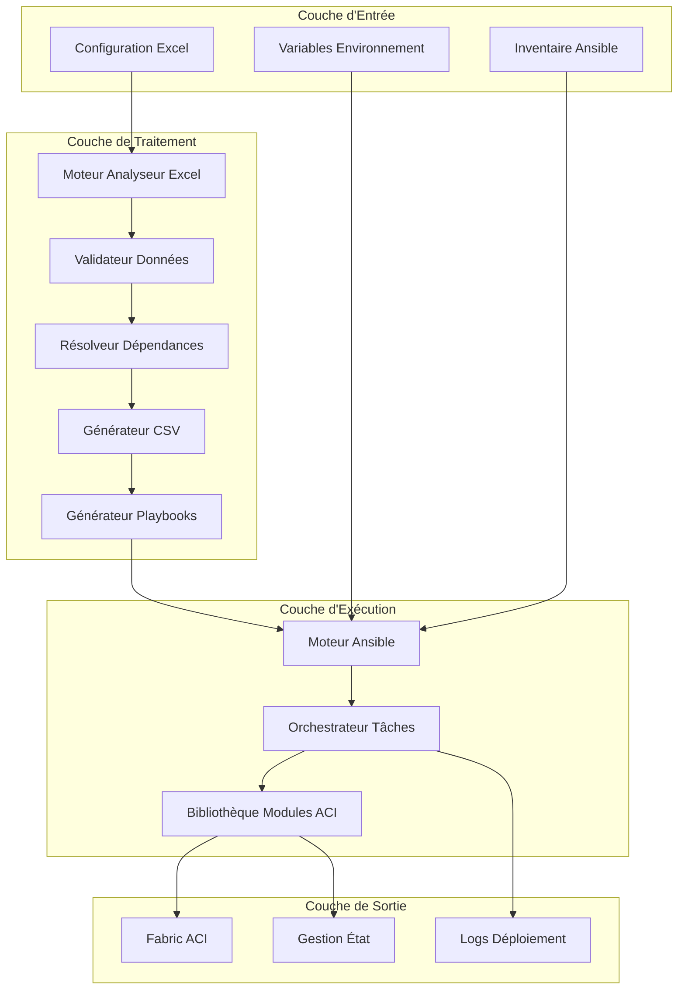
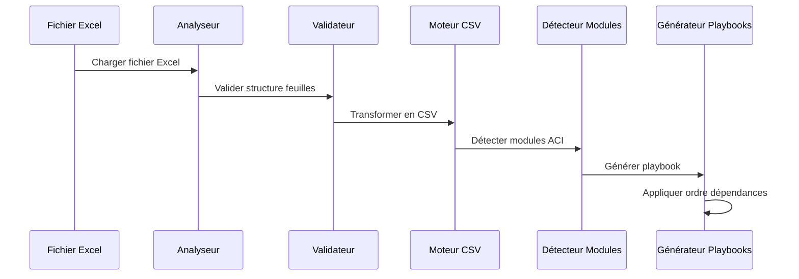
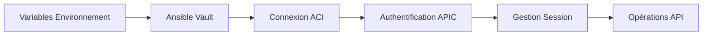
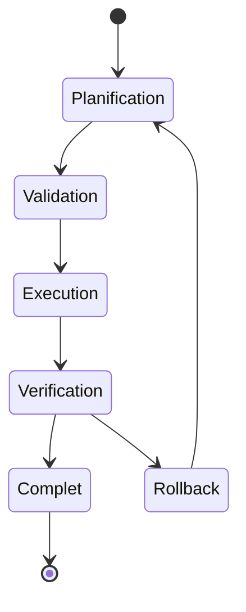

# 🏗️ Documentation Architecture

## Aperçu du Système

Le Moteur d'Automatisation ACI Fabric suit une **architecture modulaire basée sur un pipeline** qui transforme les conceptions réseau basées sur Excel en configurations ACI prêtes pour la production grâce à l'analyse intelligente, la validation et le déploiement orchestré.

## 📐 Architecture de Haut Niveau



## 🔧 Architecture des Composants

### 1. Moteur Analyseur Excel (`excel_to_csv.py`)

**Objectif** : Extraction et transformation intelligentes des configurations basées sur Excel

**Composants Clés** :
```python
class ExcelToCSVSimple:
    - Moteur Détection Feuilles
    - Couche Validation Données
    - Moteur Transformation CSV
    - Système Détection Modules
    - Générateur Playbooks Dynamique
```

**Flux de Traitement** :
1. **Découverte Feuilles** : Scanne le fichier Excel pour feuilles de configuration valides
2. **Validation Données** : Valide l'intégrité structure et contenu
3. **Filtrage Intelligent** : Exclut les feuilles système (Navigation, Template, etc.)
4. **Génération CSV** : Transforme chaque feuille valide en CSV correspondant
5. **Détection Modules** : Identifie les modules ACI requis basés sur les données
6. **Création Playbook** : Génère un playbook Ansible optimisé

### 2. Pipeline de Traitement des Données



### 3. Architecture Bibliothèque Tâches

**Structure** : 51 fichiers de tâches Ansible modulaires, chacun gérant des types d'objets ACI spécifiques

**Pattern** :
```yaml
# Structure tâche standard
- name: "Lire CSV {type_objet}"
  read_csv:
    path: "{{ csv_dir }}/{type_objet}.csv"
  register: {type_objet}_csv

- name: "Déployer objets {type_objet}"
  cisco.aci.aci_{type_objet}:
    # Paramètres connexion ACI
    # Paramètres spécifiques objet
  loop: "{{ {type_objet}_csv.list }}"
  when:
    - {type_objet}_csv is defined
    - conditions_validation
```

### 4. Système Gestion Dépendances

**Ordre Déploiement Critique** :
```yaml
ordre_deploiement:
  infrastructure:
    - vlan_pool
    - vlan_pool_encap_block
    - domain
    - domain_to_vlan_pool
    - aep
    - aep_to_domain

  politiques_interface:
    - interface_policy_cdp
    - interface_policy_link_level
    - interface_policy_lldp
    - interface_policy_leaf_policy_gr

  config_tenant:
    - tenant
    - vrf
    - bd
    - bd_subnet
    - ap
    - epg

  securite:
    - filter
    - contract
    - contract_subject
    - epg_to_contract

  l3out:
    - l3out
    - l3out_logical_node_profile
    - l3out_bgp_protocol_profile
```

## 💾 Architecture Flux de Données

### 1. Traitement Entrée
```
Fichier Excel → Analyse Feuilles → Validation Données → Conversion CSV
```

### 2. Génération Configuration
```
Fichiers CSV → Détection Modules → Résolution Dépendances → Génération Playbook
```

### 3. Exécution Déploiement
```
Playbook → Orchestration Tâches → Appels API ACI → Gestion État
```

## 🔐 Architecture Sécurité

### Flux Authentification


### Couches Sécurité
1. **Gestion Identifiants** : Variables environnement avec Ansible Vault optionnel
2. **SSL/TLS** : Validation certificats configurable
3. **Contrôle Session** : Gestion et nettoyage automatique session
4. **Piste Audit** : Journalisation complète de toutes opérations
5. **Validation État** : Vérification pré et post-déploiement

## 📊 Architecture Performance

### Stratégies Optimisation

**Exécution Parallèle** :
```yaml
config_ansible:
  forks: 5                    # Exécution tâches parallèle
  gathering: explicit         # Désactiver collecte facts inutile
  timeout: 300               # Optimisation timeout connexion
```

**Gestion Mémoire** :
- Traitement CSV streaming pour gros datasets
- Génération playbook incrémentale
- Utilisation structures données efficaces

**Optimisation Réseau** :
- Réutilisation et pooling connexions
- Opérations API batch quand possible
- Mécanismes retry intelligents

### Considérations Scalabilité

| Taille Configuration | Ressources Recommandées | Temps Déploiement |
|--------------------- |-------------------------|------------------- |
| Petite (< 100 objets) | 2GB RAM, 2 CPU | 2-5 minutes |
| Moyenne (100-500 objets) | 4GB RAM, 4 CPU | 5-15 minutes |
| Grande (500+ objets) | 8GB RAM, 8 CPU | 15-30 minutes |

## 🔄 Architecture Gestion État

### Suivi État


### Opérations État
- **present** : Créer ou mettre à jour objets
- **absent** : Supprimer objets (avec vérification dépendances)
- **query** : Récupérer informations état actuel

### Mécanisme Rollback
1. **Snapshot pré-déploiement** : Capturer état actuel
2. **Suivi incrémental** : Monitorer chaque opération
3. **Détection échec** : Identifier problèmes déploiement
4. **Rollback automatisé** : Restaurer état précédent si nécessaire

## 🔍 Monitoring et Observabilité

### Architecture Journalisation
```
Logs Application → Logs Ansible → Sortie Structurée → Tableau Analyse
```

**Niveaux Logs** :
- **INFO** : Progression opération normale
- **WARNING** : Problèmes non-critiques
- **ERROR** : Échecs déploiement
- **DEBUG** : Informations détaillées dépannage

### Métriques et Monitoring
- Taux succès/échec déploiements
- Comptes création/modification objets
- Métriques timing performance
- Catégorisation et tendances erreurs

## 🧩 Architecture Extension

### Ajout Nouveaux Objets ACI

**Étape 1** : Créer fichier tâche
```yaml
# tasks/nouvel_objet.yml
- name: "Lire CSV nouvel_objet"
  read_csv:
    path: "{{ csv_dir }}/nouvel_objet.csv"
  register: nouvel_objet_csv

- name: "Déployer nouvel_objet"
  cisco.aci.aci_nouvel_objet:
    # Paramètres objet
```

**Étape 2** : Mettre à jour analyseur
```python
# Ajouter à ordre_modules dans excel_to_csv.py
ordre_modules = [
    # ... modules existants
    'aci_nouvel_objet',
]
```

**Étape 3** : Définir structure Excel
```excel
Feuille: nouvel_objet
champ_requis1,champ_requis2,champ_optionnel3
valeur1,valeur2,valeur3
```

### Architecture Plugin
Le système supporte plugins pour :
- Règles validation personnalisées
- Sources données supplémentaires
- Formats sortie alternatifs
- Intégration avec systèmes externes

## 🔧 Architecture Développement

### Organisation Code
```
production_ready/
├── excel_to_csv.py    # Moteur analyse principal
├── tasks/                    # Gestionnaires objets ACI
├── csv/                     # Fichiers données générés
├── logs/                    # Logs opération
├── ansible.cfg              # Configuration Ansible
├── inventory.yml            # Configuration cible
└── .env.example            # Modèle environnement
```

### Patterns Conception
- **Pattern Factory** : Génération playbook dynamique
- **Pattern Strategy** : Modes déploiement configurables
- **Pattern Observer** : Journalisation pilotée événements
- **Pattern Template Method** : Exécution tâches standardisée

### Architecture Tests
- **Tests Unitaires** : Validation composants individuels
- **Tests Intégration** : Tests workflow end-to-end
- **Tests Validation** : Vérification modèles Excel
- **Tests Performance** : Validation scalabilité

Cette architecture assure **scalabilité**, **maintenabilité** et **fiabilité** tout en fournissant la flexibilité nécessaire pour divers scénarios de déploiement ACI.