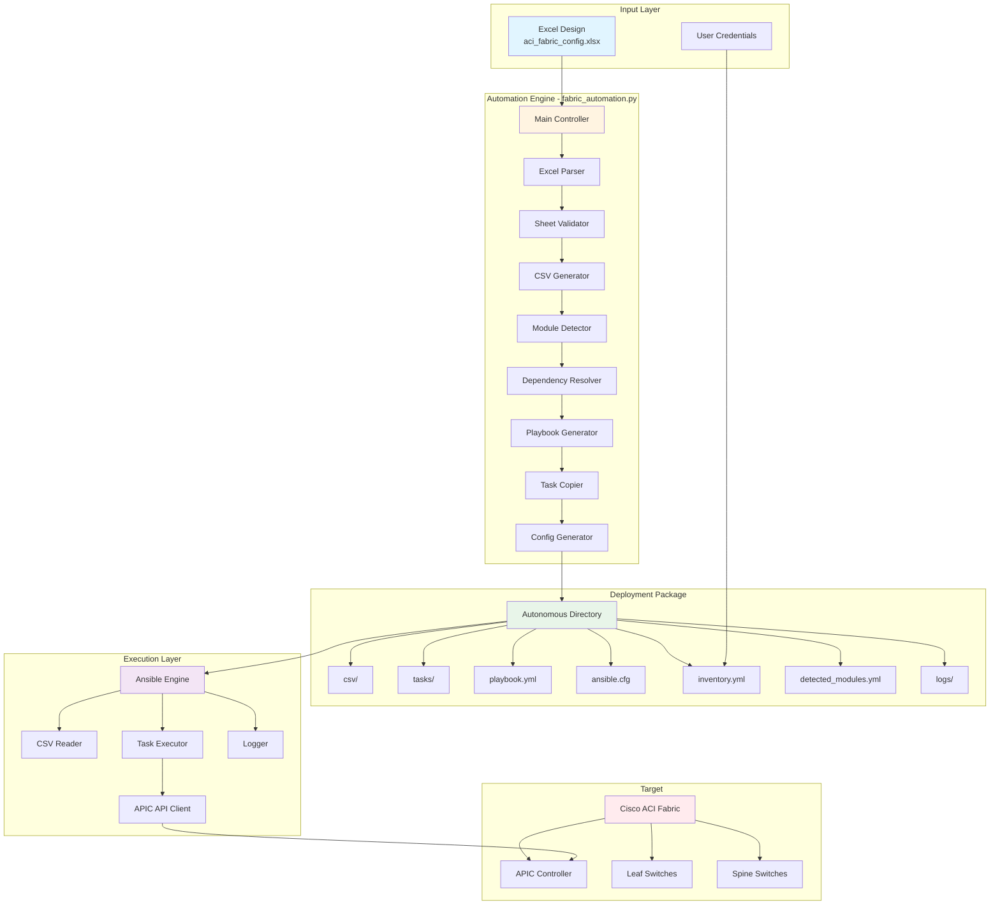
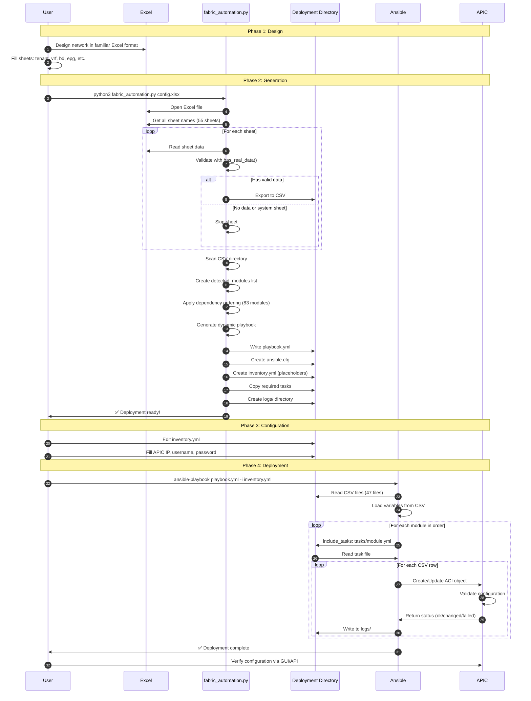
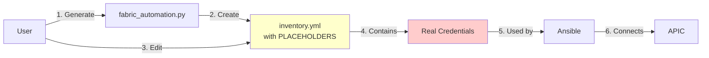

# 🏗️ Architecture Documentation

Complete architectural documentation for the ACI Fabric Automation Engine.

## 📋 Table of Contents

- [System Overview](#system-overview)
- [Component Architecture](#component-architecture)
- [Data Flow](#data-flow)
- [Module Descriptions](#module-descriptions)
- [Design Patterns](#design-patterns)
- [Scalability and Performance](#scalability-and-performance)

## 🎯 System Overview

The ACI Fabric Automation Engine (`fabric_automation.py`) follows a **modular, pipeline-based architecture** that transforms Excel-based network designs into production-ready ACI configurations through intelligent parsing, validation, and orchestrated deployment.

### Key Architectural Principles

1. **Separation of Concerns**: Clear separation between data (Excel/CSV), logic (Python), and execution (Ansible)
2. **Autonomous Deployments**: Self-contained deployment packages with all dependencies
3. **Dependency-Driven Execution**: Intelligent ordering of ACI object creation
4. **Idempotent Operations**: Safe to run multiple times without side effects
5. **Fail-Fast Validation**: Early detection of configuration errors

## 🏗️ Component Architecture

### High-Level System Diagram



## 🔄 Data Flow

### Complete Workflow Sequence



### Data Transformation Pipeline

```
┌─────────────────────────────────────────────────────────────────┐
│ EXCEL SHEETS                                                     │
│ ┌──────────┐ ┌──────────┐ ┌──────────┐                         │
│ │ tenant   │ │   vrf    │ │   bd     │  ... 47 sheets           │
│ └──────────┘ └──────────┘ └──────────┘                         │
└─────────────────────────────────────────────────────────────────┘
                            │
                            ▼ Excel Parser (pandas)
┌─────────────────────────────────────────────────────────────────┐
│ CSV FILES                                                        │
│ ┌────────────┐ ┌────────────┐ ┌────────────┐                   │
│ │ tenant.csv │ │  vrf.csv   │ │  bd.csv    │  ... 47 CSV       │
│ └────────────┘ └────────────┘ └────────────┘                   │
└─────────────────────────────────────────────────────────────────┘
                            │
                            ▼ Module Detector
┌─────────────────────────────────────────────────────────────────┐
│ DETECTED MODULES                                                 │
│ ┌─────────────────────────────────────────────────────────────┐ │
│ │ - aci_tenant                                                │ │
│ │ - aci_vrf                                                   │ │
│ │ - aci_bd                                                    │ │
│ │ ... (47 modules)                                            │ │
│ └─────────────────────────────────────────────────────────────┘ │
└─────────────────────────────────────────────────────────────────┘
                            │
                            ▼ Dependency Resolver
┌─────────────────────────────────────────────────────────────────┐
│ ORDERED MODULES (83-step sequence)                              │
│ 1. aci_vlan_pool          ← Infrastructure first                │
│ 2. aci_domain                                                    │
│ 3. aci_aep                                                       │
│ ...                                                              │
│ 20. aci_tenant            ← Tenant objects                       │
│ 21. aci_vrf                                                      │
│ 22. aci_bd                                                       │
│ ...                                                              │
│ 80. aci_route_control_profile  ← Route control last             │
└─────────────────────────────────────────────────────────────────┘
                            │
                            ▼ Playbook Generator
┌─────────────────────────────────────────────────────────────────┐
│ DYNAMIC PLAYBOOK                                                 │
│ ┌─────────────────────────────────────────────────────────────┐ │
│ │ - name: Deploy ACI from config.xlsx                         │ │
│ │   tasks:                                                    │ │
│ │     - include_tasks: tasks/vlan_pool.yml                    │ │
│ │     - include_tasks: tasks/domain.yml                       │ │
│ │     - include_tasks: tasks/tenant.yml                       │ │
│ │     ...                                                     │ │
│ └─────────────────────────────────────────────────────────────┘ │
└─────────────────────────────────────────────────────────────────┘
                            │
                            ▼ Ansible Execution
┌─────────────────────────────────────────────────────────────────┐
│ ACI FABRIC CONFIGURATION                                         │
│ ┌──────────────┐ ┌──────────────┐ ┌──────────────┐             │
│ │    Tenants   │ │     VRFs     │ │     BDs      │  ...         │
│ └──────────────┘ └──────────────┘ └──────────────┘             │
└─────────────────────────────────────────────────────────────────┘
```

## 📦 Module Descriptions

### 1. Excel Parser (`ExcelToCSVSimple` class)

**Purpose**: Read and validate Excel file, export sheets to CSV

**Key Methods**:
```python
class ExcelToCSVSimple:
    def __init__(excel_file, csv_dir, deployment_dir):
        """Initialize parser with file paths"""

    def clean_csv_directory():
        """Remove and recreate CSV directory"""

    def has_real_data(sheet_name):
        """Intelligent detection of sheets with actual data"""
        # Returns True if first column (after header) has data

    def export_sheet_to_csv(sheet_name):
        """Export one sheet to CSV format"""
        # Converts boolean to strings
        # Writes UTF-8 encoded CSV

    def get_excel_sheets():
        """Get list of all sheet names"""

    def process_all_sheets():
        """Main processing loop"""
        # Iterates all sheets
        # Validates each sheet
        # Exports valid sheets
        # Provides statistics
```

**Logic Flow**:
```
1. Clean CSV directory (fresh start)
2. Get all Excel sheets
3. For each sheet:
   a. Check if in ignore_sheets (Navigation, Sheet1-3, Template, etc.)
   b. Call has_real_data() to validate
   c. If valid: export_sheet_to_csv()
   d. If invalid: skip with message
4. Report statistics
```

**System Sheets (ignored)**:
- Navigation
- Sheet1, Sheet2, Sheet3
- Template, Example, README

### 2. Sheet Validator (`has_real_data` method)

**Purpose**: Intelligent detection of valid data sheets

**Algorithm**:
```python
def has_real_data(sheet_name):
    # Load sheet
    df = pd.read_excel(excel_file, sheet_name=sheet_name)

    # Check 1: Empty DataFrame?
    if df.empty:
        return False

    # Get first column
    first_col = df.iloc[:, 0]

    # Check 2: Single row case (header only)
    if len(first_col) == 1:
        value = first_col.iloc[0]
        return pd.notna(value) and str(value).strip()

    # Check 3: Multi-row case (look for data after header)
    for i in range(1, len(first_col)):  # Start at row 1 (skip header)
        value = first_col.iloc[i]
        if pd.notna(value) and str(value).strip():
            return True  # Found data!

    return False  # No data found
```

**Why This Works**:
- Row 0: Header (column names)
- Row 1+: Actual data
- Only checks first column for performance
- Handles edge cases (empty, single row, etc.)

### 3. CSV Generator

**Purpose**: Transform Excel data to CSV format

**Features**:
- Boolean handling: Converts `True/False` to `"True"/"False"` strings
- UTF-8 encoding: Supports international characters
- Clean formatting: Proper CSV structure for Ansible consumption

**Output Format**:
```csv
tenant,description
Production,Production tenant
Development,Development tenant
DMZ,Demilitarized zone tenant
```

### 4. Module Detector

**Purpose**: Identify required ACI modules from CSV files

**Logic**:
```python
def create_detected_modules_list():
    csv_files = list(csv_dir.glob("*.csv"))

    detected_modules = []
    for csv_file in csv_files:
        sheet_name = csv_file.stem  # tenant.csv → tenant
        module_name = f"aci_{sheet_name}"  # → aci_tenant
        detected_modules.append(module_name)

    # Write detected_modules_csv.yml
    # Return list for playbook generation
```

**Output** (`detected_modules_csv.yml`):
```yaml
# Modules ACI détectés depuis les fichiers CSV
detected_modules:
  - aci_tenant
  - aci_vrf
  - aci_bd
  # ... (47 modules)
```

### 5. Dependency Resolver

**Purpose**: Order modules by ACI dependency requirements

**83-Module Sequence** (7 phases):

```python
module_order = [
    # Phase 1: Infrastructure Foundation (7 modules)
    'aci_vlan_pool',                    # VLAN pools must exist first
    'aci_vlan_pool_encap_block',        # Blocks within pools
    'aci_domain',                       # Domains need pools
    'aci_domain_to_vlan_pool',          # Association
    'aci_aep',                          # AEP needs domains
    'aci_aep_to_domain',                # Association
    'aci_switch_policy_vpc_protection_gr',  # VPC groups

    # Phase 2: Interface Policies (8 modules)
    'aci_interface_policy_cdp',
    'aci_interface_policy_link_level',
    'aci_interface_policy_lldp',
    'aci_interface_policy_mcp',
    'aci_interface_policy_port_channel',
    'aci_interface_policy_spanning_tree',
    'aci_interface_config',
    'aci_interface_policy_leaf_policy_gr',

    # Phase 3: Switch/Interface Profiles (5 modules)
    'aci_switch_policy_leaf_profile',
    'aci_interface_policy_leaf_profile',
    'aci_switch_leaf_selector',
    'aci_int_sel_to_switch_policy_leaf',
    'aci_access_port_to_int_policy_leaf',

    # Phase 4: Tenant Configuration (9 modules)
    'aci_tenant',                       # Tenant must exist first
    'aci_vrf',                          # VRF within tenant
    'aci_bd',                           # BD within tenant
    'aci_bd_subnet',                    # Subnet within BD
    'aci_bd_to_l3out',                  # BD associations
    'aci_ap',                           # Application Profile
    'aci_epg',                          # EPG within AP
    'aci_aep_to_epg',                   # Associations
    'aci_epg_to_domain',                # Associations

    # Phase 5: BGP Policies (3 modules)
    'aci_bgp_timers_policy',
    'aci_bgp_best_path_policy',
    'aci_bgp_address_family_context_policy',

    # Phase 6: Security (5 modules)
    'aci_filter',                       # Filters first
    'aci_contract',                     # Contracts need filters
    'aci_contract_subject',             # Subjects within contracts
    'aci_contract_subject_to_filter',   # Associations
    'aci_epg_to_contract',              # EPG bindings

    # Phase 7: L3Out & Route Control (20+ modules)
    'aci_l3out',                        # L3Out base
    'aci_l3out_logical_node_profile',
    'aci_l3out_logical_node',
    'aci_l3out_logical_interface_profile',
    'aci_l3out_interface',
    'aci_l3out_bgp_protocol_profile',
    'aci_l3out_bgp_peer',
    'aci_l3out_floating_svi',
    'aci_l3out_floating_svi_path',
    'aci_l3out_bgp_peer_floating',
    'aci_l3out_extepg',
    'aci_l3out_extsubnet',
    'aci_l3out_extepg_to_contract',
    'aci_l3out_logical_interface_vpc_member',
    'aci_l3out_floating_svi_secondary_ip',
    'aci_l3out_floating_svi_path_secondary_ip',
    # Route Control (must be last)
    'aci_match_rule',
    'aci_match_route_destination',
    'aci_route_control_profile',
    'aci_route_control_context'
]
```

**Why This Order Matters**:
```
Example dependency chain:
EPG requires:
  → Application Profile (AP)
    → Tenant
  → Bridge Domain (BD)
    → Tenant
    → VRF
      → Tenant
  → Domain
    → VLAN Pool

Creating EPG before VLAN Pool = FAILURE
Creating in correct order = SUCCESS
```

### 6. Playbook Generator

**Purpose**: Create dynamic Ansible playbook with correct task ordering

**Generated Structure**:
```yaml
---
- name: "Déploiement ACI depuis config.xlsx"
  hosts: localhost
  connection: local
  gather_facts: false

  vars:
    csv_dir: "csv"
    global_state: "{{ deployment_state | default('present') }}"

  pre_tasks:
    - name: "Display deployment info"
      debug:
        msg:
          - "Excel: config.xlsx"
          - "Modules: 47"
          - "Action: DEPLOYMENT"

    - name: "Verify CSV directory exists"
      stat:
        path: "{{ csv_dir }}"
      register: csv_dir_stat
      failed_when: not csv_dir_stat.stat.exists

  tasks:
    - name: "Include tasks for VLAN Pools"
      include_tasks: tasks/vlan_pool.yml
      tags:
        - vlan_pool
        - aci_vlan_pool

    - name: "Include tasks for Domains"
      include_tasks: tasks/domain.yml
      tags:
        - domain
        - aci_domain

    # ... (45 more task includes in dependency order)

  post_tasks:
    - name: "Deployment summary"
      debug:
        msg:
          - "Deployment from config.xlsx complete"
          - "Modules processed: 47"
```

**Key Features**:
- **Dynamic**: Only includes tasks for detected modules
- **Ordered**: Uses 83-step dependency sequence
- **Tagged**: Each task has 2 tags for selective execution
- **Validated**: Pre-tasks check CSV directory exists
- **Informative**: Pre/post tasks provide deployment info

### 7. Task Copier (Autonomous Feature)

**Purpose**: Copy only required Ansible tasks for self-contained deployment

**Logic**:
```python
def copy_needed_tasks():
    # Create tasks/ directory in deployment
    tasks_dest_dir = deployment_dir / 'tasks'
    tasks_dest_dir.mkdir(exist_ok=True)

    # Find source tasks directory
    # Try: production_ready/tasks/ OR parent/tasks/
    tasks_source_dir = Path(__file__).parent / 'production_ready' / 'tasks'
    if not exists:
        tasks_source_dir = Path(__file__).parent / 'tasks'

    # Copy only needed tasks
    for module in detected_modules:
        task_name = module.replace('aci_', '') + '.yml'
        source = tasks_source_dir / task_name
        dest = tasks_dest_dir / task_name

        if source.exists():
            shutil.copy2(source, dest)  # Copy with metadata
        else:
            print(f"⚠️  {task_name} not found")
```

**Benefits**:
- **Autonomous**: Deployment directory is self-contained
- **Portable**: Can be moved/shared without external dependencies
- **Minimal**: Only copies required files (not all 55 tasks)
- **Efficient**: Smaller deployment packages

**Example**:
```
If Excel has: tenant, vrf, bd (3 sheets)
Then copies:  tenant.yml, vrf.yml, bd.yml (3 tasks)
Not copied:   l3out.yml, contract.yml, ... (52 other tasks)
```

### 8. Configuration Generator

**Purpose**: Create Ansible configuration files

**Files Generated**:

#### `ansible.cfg`
```ini
[defaults]
inventory = inventory.yml
host_key_checking = False
retry_files_enabled = False
deprecation_warnings = False
stdout_callback = yaml
bin_ansible_callbacks = True

[privilege_escalation]
become = False
```

#### `inventory.yml` (with placeholders)
```yaml
---
all:
  hosts:
    localhost:
      ansible_connection: local
      ansible_python_interpreter: "{{ ansible_playbook_python }}"

      # Variables de connexion ACI
      # ⚠️  IMPORTANT: Remplir les valeurs ci-dessous avant de déployer
      aci_hostname: "YOUR_APIC_IP_HERE"          # Ex: 192.168.1.1
      aci_username: "YOUR_USERNAME_HERE"          # Ex: admin
      aci_password: "YOUR_PASSWORD_HERE"          # Ex: MyPassword123
      aci_validate_certs: false
```

**Security**: Uses placeholders to avoid accidental credential exposure

## 🎨 Design Patterns

### 1. Pipeline Pattern
```
Excel → Parse → Validate → Transform → Generate → Package → Deploy
```

Each stage is independent and can be tested separately.

### 2. Strategy Pattern
```python
# Different strategies for finding tasks directory
tasks_source_dir = Path(__file__).parent / 'production_ready' / 'tasks'
if not exists:
    tasks_source_dir = Path(__file__).parent / 'tasks'
```

### 3. Factory Pattern
```python
# Dynamic creation of module names
for csv_file in csv_files:
    module_name = f"aci_{csv_file.stem}"  # Factory method
```

### 4. Template Pattern
```python
# Playbook generation uses template structure
playbook_content = f'''
---
- name: "Déploiement ACI depuis {excel_name}.xlsx"
  tasks:'''

for module in ordered_modules:
    playbook_content += f'''
    - include_tasks: tasks/{module}.yml'''
```

## 📊 Scalability and Performance

### Performance Characteristics

| Metric | Value | Notes |
|--------|-------|-------|
| Excel parsing | ~5-10 seconds | For 55 sheets |
| CSV generation | ~2-5 seconds | 47 CSV files |
| Playbook creation | <1 second | Dynamic YAML generation |
| Task copying | ~1-2 seconds | 47 tasks |
| **Total generation time** | **~10-20 seconds** | Full deployment package |
| Ansible execution | 5-30 minutes | Depends on object count and APIC performance |

### Scalability Limits

| Resource | Limit | Recommendation |
|----------|-------|----------------|
| Excel sheets | 1000+ | No hard limit |
| CSV rows per sheet | 10,000+ | Pandas handles large datasets |
| Total ACI objects | 5,000+ | Limited by APIC, not automation |
| Concurrent deployments | Unlimited | Each deployment is independent |
| Supported modules | 83 (expandable) | Add to module_order list |

### Optimization Strategies

1. **Selective Execution**: Use Ansible tags to deploy only specific modules
   ```bash
   ansible-playbook config.yml --tags "tenant,vrf"
   ```

2. **Parallel Execution**: Deploy to multiple sites simultaneously
   ```bash
   python3 fabric_automation.py site1.xlsx &
   python3 fabric_automation.py site2.xlsx &
   ```

3. **Incremental Updates**: Modify Excel and regenerate - only changed objects updated

4. **Task Optimization**: Only required tasks copied (not all 55)

## 🔒 Security Architecture

### Security Layers

```
1. Credential Protection
   ├─ No hardcoded passwords
   ├─ Placeholders in generated inventory.yml
   └─ User must explicitly fill credentials

2. File System Security
   ├─ Deployment directories isolated
   ├─ No modification of source files
   └─ Logs separated per deployment

3. Network Security
   ├─ HTTPS to APIC (SSL/TLS)
   ├─ Certificate validation (configurable)
   └─ No credential transmission in logs

4. Execution Security
   ├─ Idempotent operations (safe to retry)
   ├─ Dry-run mode available (--check)
   └─ Rollback support (state=absent)
```

### Credential Management Flow



**Security Note**: Credentials never stored in version control or logs.

## 🧪 Testing Strategy

### Unit Testing Scope
- Excel parsing logic
- Sheet validation (`has_real_data`)
- CSV generation
- Module detection
- Dependency ordering

### Integration Testing Scope
- Full generation pipeline
- Ansible playbook syntax
- Task file loading
- APIC connectivity (with test APIC)

### Validation Points
1. Pre-execution: Syntax validation
2. Dry-run: `ansible-playbook --check`
3. Post-execution: Log analysis
4. APIC verification: Configuration review

---

**Architecture Version**: 2.0
**Last Updated**: 2025-11-28
**Automation Engine**: fabric_automation.py
