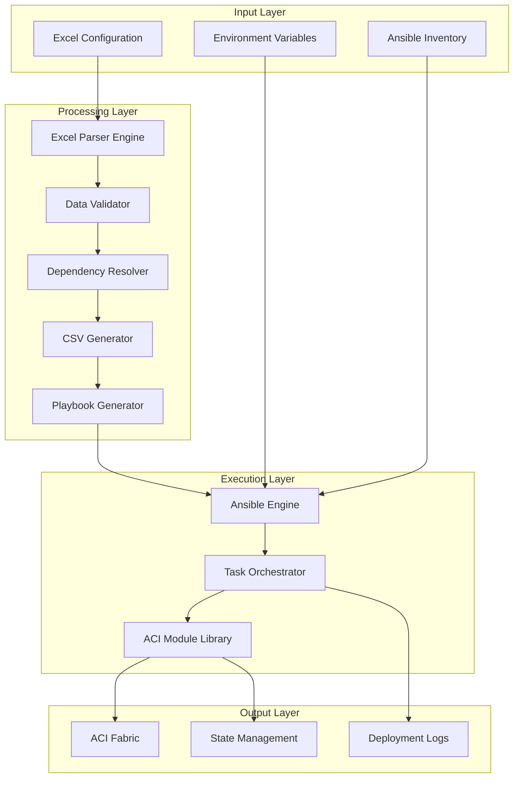
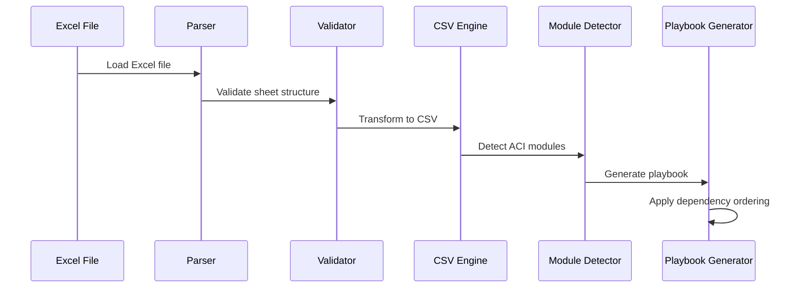
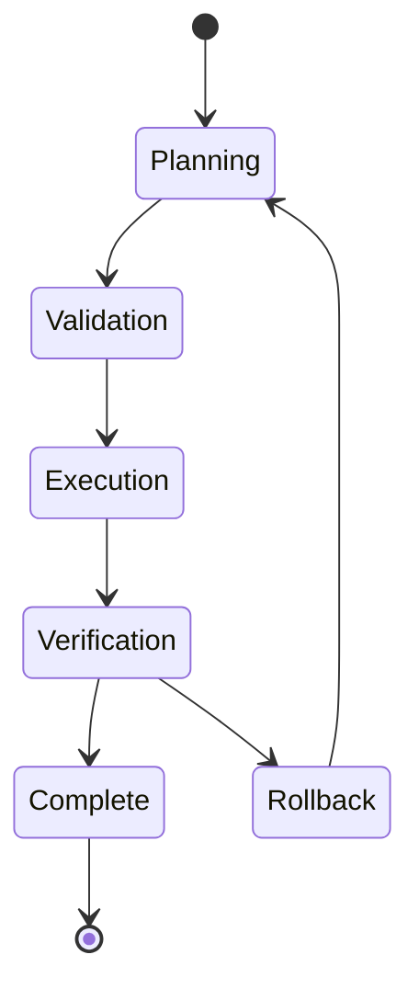

# 🏗️ Architecture Documentation

## System Overview

The ACI Fabric Automation Engine follows a **modular, pipeline-based architecture** that transforms Excel-based network designs into production-ready ACI configurations through intelligent parsing, validation, and orchestrated deployment.

## 📐 High-Level Architecture



## 🔧 Component Architecture

### 1. Excel Parser Engine (`excel_to_csv.py`)

**Purpose**: Intelligent extraction and transformation of Excel-based configurations

**Key Components**:
```python
class ExcelToCSVSimple:
    - Sheet Detection Engine
    - Data Validation Layer
    - CSV Transformation Engine
    - Module Detection System
    - Dynamic Playbook Generator
```

**Processing Flow**:
1. **Sheet Discovery**: Scans Excel file for valid configuration sheets
2. **Data Validation**: Validates structure and content integrity
3. **Intelligent Filtering**: Excludes system sheets (Navigation, Template, etc.)
4. **CSV Generation**: Transforms each valid sheet to corresponding CSV
5. **Module Detection**: Identifies required ACI modules based on data
6. **Playbook Creation**: Generates optimized Ansible playbook

### 2. Data Processing Pipeline



### 3. Task Library Architecture

**Structure**: 51 modular Ansible task files, each handling specific ACI object types

**Pattern**:
```yaml
# Standard task structure
- name: "Read CSV {object_type}"
  read_csv:
    path: "{{ csv_dir }}/{object_type}.csv"
  register: {object_type}_csv

- name: "Deploy {object_type} objects"
  cisco.aci.aci_{object_type}:
    # ACI connection parameters
    # Object-specific parameters
  loop: "{{ {object_type}_csv.list }}"
  when:
    - {object_type}_csv is defined
    - validation_conditions
```

### 4. Dependency Management System

**Critical Deployment Order**:
```yaml
deployment_order:
  infrastructure:
    - vlan_pool
    - vlan_pool_encap_block
    - domain
    - domain_to_vlan_pool
    - aep
    - aep_to_domain

  interface_policies:
    - interface_policy_cdp
    - interface_policy_link_level
    - interface_policy_lldp
    - interface_policy_leaf_policy_gr

  tenant_config:
    - tenant
    - vrf
    - bd
    - bd_subnet
    - ap
    - epg

  security:
    - filter
    - contract
    - contract_subject
    - epg_to_contract

  l3out:
    - l3out
    - l3out_logical_node_profile
    - l3out_bgp_protocol_profile
```

## 💾 Data Flow Architecture

### 1. Input Processing
```
Excel File → Sheet Analysis → Data Validation → CSV Conversion
```

### 2. Configuration Generation
```
CSV Files → Module Detection → Dependency Resolution → Playbook Generation
```

### 3. Deployment Execution
```
Playbook → Task Orchestration → ACI API Calls → State Management
```

## 🔐 Security Architecture

### Authentication Flow


### Security Layers
1. **Credential Management**: Environment variables with optional Ansible Vault
2. **SSL/TLS**: Configurable certificate validation
3. **Session Control**: Automatic session management and cleanup
4. **Audit Trail**: Comprehensive logging of all operations
5. **State Validation**: Pre and post-deployment verification

## 📊 Performance Architecture

### Optimization Strategies

**Parallel Execution**:
```yaml
ansible_config:
  forks: 5                    # Parallel task execution
  gathering: explicit         # Disable unnecessary fact gathering
  timeout: 300               # Connection timeout optimization
```

**Memory Management**:
- Streaming CSV processing for large datasets
- Incremental playbook generation
- Efficient data structure usage

**Network Optimization**:
- Connection reuse and pooling
- Batch API operations where possible
- Intelligent retry mechanisms

### Scalability Considerations

| Configuration Size | Recommended Resources | Deployment Time |
|-------------------|----------------------|-----------------|
| Small (< 100 objects) | 2GB RAM, 2 CPU | 2-5 minutes |
| Medium (100-500 objects) | 4GB RAM, 4 CPU | 5-15 minutes |
| Large (500+ objects) | 8GB RAM, 8 CPU | 15-30 minutes |

## 🔄 State Management Architecture

### State Tracking


### State Operations
- **present**: Create or update objects
- **absent**: Remove objects (with dependency checking)
- **query**: Retrieve current state information

### Rollback Mechanism
1. **Pre-deployment snapshot**: Capture current state
2. **Incremental tracking**: Monitor each operation
3. **Failure detection**: Identify deployment issues
4. **Automated rollback**: Restore previous state if needed

## 🔍 Monitoring and Observability

### Logging Architecture
```
Application Logs → Ansible Logs → Structured Output → Analysis Dashboard
```

**Log Levels**:
- **INFO**: Normal operation progress
- **WARNING**: Non-critical issues
- **ERROR**: Deployment failures
- **DEBUG**: Detailed troubleshooting information

### Metrics and Monitoring
- Deployment success/failure rates
- Object creation/modification counts
- Performance timing metrics
- Error categorization and trends

## 🧩 Extension Architecture

### Adding New ACI Objects

**Step 1**: Create task file
```yaml
# tasks/new_object.yml
- name: "Read CSV new_object"
  read_csv:
    path: "{{ csv_dir }}/new_object.csv"
  register: new_object_csv

- name: "Deploy new_object"
  cisco.aci.aci_new_object:
    # Object parameters
```

**Step 2**: Update parser
```python
# Add to module_order in excel_to_csv.py
module_order = [
    # ... existing modules
    'aci_new_object',
]
```

**Step 3**: Define Excel structure
```excel
Sheet: new_object
required_field1,required_field2,optional_field3
value1,value2,value3
```

### Plugin Architecture
The system supports plugins for:
- Custom validation rules
- Additional data sources
- Alternative output formats
- Integration with external systems

## 🔧 Development Architecture

### Code Organization
```
production_ready/
├── excel_to_csv.py    # Core parsing engine
├── tasks/                    # ACI object handlers
├── csv/                     # Generated data files
├── logs/                    # Operation logs
├── ansible.cfg              # Ansible configuration
├── inventory.yml            # Target configuration
└── .env.example            # Environment template
```

### Design Patterns
- **Factory Pattern**: Dynamic playbook generation
- **Strategy Pattern**: Configurable deployment modes
- **Observer Pattern**: Event-driven logging
- **Template Method**: Standardized task execution

### Testing Architecture
- **Unit Tests**: Individual component validation
- **Integration Tests**: End-to-end workflow testing
- **Validation Tests**: Excel template verification
- **Performance Tests**: Scalability validation

This architecture ensures **scalability**, **maintainability**, and **reliability** while providing the flexibility needed for diverse ACI deployment scenarios.