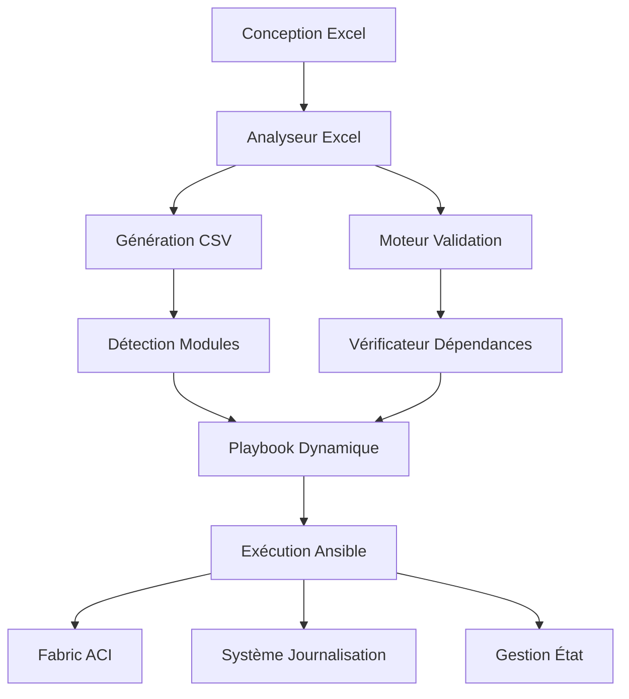

# 🚀 Moteur d'Automatisation ACI Fabric

[](https://opensource.org/licenses/MIT)
[](https://www.python.org/downloads/)
[](https://docs.ansible.com/)
[](https://www.cisco.com/c/en/us/solutions/data-center-virtualization/application-centric-infrastructure/index.html)

> **Solution d'automatisation de niveau entreprise pour le déploiement de fabric Cisco ACI utilisant la gestion de configuration pilotée par Excel.**

## 📋 Table des Matières

- [Aperçu](#aperçu)
- [Fonctionnalités](#fonctionnalités)
- [Architecture](#architecture)
- [Démarrage Rapide](#démarrage-rapide)
- [Installation](#installation)
- [Utilisation](#utilisation)
- [Structure du Modèle Excel](#structure-du-modèle-excel)
- [Objets ACI Supportés](#objets-aci-supportés)
- [Configuration](#configuration)
- [Exemples](#exemples)
- [Dépannage](#dépannage)
- [Contribuer](#contribuer)
- [Licence](#licence)

## 🎯 Aperçu

Le **Moteur d'Automatisation ACI Fabric** est une solution prête pour la production qui transforme les conceptions réseau basées sur Excel en fabrics Cisco ACI entièrement déployés. En tirant parti de l'analyse intelligente d'Excel et de la génération dynamique de playbooks Ansible, il élimine les erreurs de configuration manuelle et accélère le déploiement de fabric de plusieurs jours à quelques minutes.

### Avantages Clés

- **🎨 Approche Design-First** : Les ingénieurs réseau travaillent dans l'environnement Excel familier
- **⚡ Déploiement Rapide** : Déploiement complet de fabric en moins de 30 minutes
- **🛡️ Prévention d'Erreurs** : Validation automatisée et gestion des dépendances
- **🔄 Cycle de Vie Complet** : Support pour la création, modification et suppression
- **📊 Prêt pour la Production** : Journalisation, validation et capacités de rollback de niveau entreprise

## ✨ Fonctionnalités

### Capacités Principales
- **Analyse Intelligente d'Excel** : Détection automatique des feuilles de configuration valides
- **Génération Dynamique de Playbooks** : Crée des playbooks Ansible optimisés basés sur vos données
- **Gestion des Dépendances** : Assure l'ordre de déploiement correct pour les objets ACI
- **Gestion d'État** : Support pour les opérations de création (`present`) et suppression (`absent`)
- **Mode Dry-Run** : Teste les configurations sans apporter de modifications
- **Journalisation Complète** : Piste d'audit complète de toutes les opérations

### Environnements Supportés
- **Cisco ACI** : Toutes les versions APIC modernes (4.x, 5.x, 6.x)
- **Python** : 3.8+ avec support pandas
- **Ansible** : Core 2.12+ avec collection cisco.aci
- **Excel** : Fichiers .xlsx avec feuilles de données structurées

## 🏗️ Architecture



### Aperçu des Composants

| Composant | Objectif | Technologie |
|-----------|----------|-------------|
| **Analyseur Excel** | Détection et validation intelligentes des feuilles | Python + Pandas |
| **Moteur CSV** | Transformation et normalisation des données | Python |
| **Détecteur Modules** | Découverte dynamique des objets ACI | Python |
| **Générateur Playbooks** | Création d'automatisation Ansible | Python + Jinja2 |
| **Bibliothèque Tâches** | 50+ gestionnaires d'objets ACI | Ansible + YAML |
| **Moteur Déploiement** | Déploiement fabric orchestré | Ansible + cisco.aci |

## 🚀 Démarrage Rapide

### Prérequis
```bash
# Installer les dépendances Python
pip install pandas openpyxl

# Installer Ansible et la collection ACI
pip install ansible
ansible-galaxy collection install cisco.aci
```

### Démo en 30 Secondes
```bash
# 1. Cloner et configurer
git clone https://github.com/JFGrenier07/aci-fabric-automation.git
cd aci-fabric-automation
cp .env.example .env

# 2. Configurer vos identifiants APIC dans .env
vim .env

# 3. Convertir Excel en configuration prête pour déploiement
python3 excel_to_csv.py aci_fabric_config.xlsx

# 4. Déployer sur le fabric ACI
ansible-playbook -i inventory.yml aci_fabric_config.yml
```

## 📦 Installation

### Exigences Système
- **Système d'Exploitation** : Linux, macOS, ou Windows avec WSL
- **Python** : 3.8 ou supérieur
- **Mémoire** : 2GB+ recommandé pour les grandes configurations
- **Réseau** : Connectivité à l'interface de gestion APIC

### Configuration Détaillée

1. **Cloner le dépôt**
   ```bash
   git clone https://github.com/JFGrenier07/aci-fabric-automation.git
   cd aci-fabric-automation
   ```

2. **Créer un environnement virtuel Python**
   ```bash
   python3 -m venv venv
   source venv/bin/activate  # Sur Windows: venv\Scripts\activate
   ```

3. **Installer les dépendances**
   ```bash
   pip install -r requirements.txt
   ansible-galaxy collection install cisco.aci
   ```

4. **Configurer l'environnement**
   ```bash
   cp .env.example .env
   # Éditer .env avec vos identifiants APIC
   ```

5. **Vérifier l'installation**
   ```bash
   python3 excel_to_csv.py --help
   ansible --version
   ```

## 💼 Utilisation

### Flux de Travail de Base

#### Étape 1 : Préparer la Configuration Excel
Créer ou modifier votre fichier Excel en suivant la [structure du modèle](#structure-du-modèle-excel) :

```excel
Feuille: vlan_pool
pool,description,pool_allocation_mode
Prod_VLAN_Pool,Pool VLAN Production,static
Dev_VLAN_Pool,Pool VLAN Développement,dynamic

Feuille: tenant
tenant,description
Production,Environnement production
Development,Environnement développement
```

#### Étape 2 : Générer la Configuration
```bash
# Convertir Excel au format prêt pour Ansible
python3 excel_to_csv.py votre_conception_fabric.xlsx

# Ceci crée :
# - répertoire csv/ avec fichiers d'objets individuels
# - detected_modules_csv.yml (objets découverts)
# - votre_conception_fabric.yml (playbook de déploiement)
```

#### Étape 3 : Valider la Configuration
```bash
# Dry-run pour valider sans modifications
ansible-playbook -i inventory.yml votre_conception_fabric.yml --check

# Validation de syntaxe
ansible-playbook --syntax-check votre_conception_fabric.yml
```

#### Étape 4 : Déployer sur ACI
```bash
# Déploiement complet
ansible-playbook -i inventory.yml votre_conception_fabric.yml

# Déployer des composants spécifiques
ansible-playbook -i inventory.yml votre_conception_fabric.yml --tags "infrastructure"
ansible-playbook -i inventory.yml votre_conception_fabric.yml --tags "tenants"
```

### Opérations Avancées

#### Déploiement Sélectif
```bash
# Déployer seulement les pools VLAN et domaines
ansible-playbook -i inventory.yml config.yml --tags "vlan_pool,domain"

# Déployer tout sauf L3Out
ansible-playbook -i inventory.yml config.yml --skip-tags "l3out"
```

#### Gestion d'État
```bash
# Créer tous les objets (par défaut)
ansible-playbook -i inventory.yml config.yml

# Supprimer tous les objets (DESTRUCTIF)
ansible-playbook -i inventory.yml config.yml -e "deployment_state=absent"

# Interroger la configuration existante
ansible-playbook -i inventory.yml config.yml -e "deployment_state=query"
```

#### Mises à Jour Incrémentales
```bash
# Mettre à jour la configuration de tenant spécifique
ansible-playbook -i inventory.yml config.yml --tags "tenant,vrf,bd,epg"

# Ajouter de nouvelles politiques d'interface
ansible-playbook -i inventory.yml config.yml --tags "interface_policy"
```

## 📊 Structure du Modèle Excel

### Convention de Nommage des Feuilles
Chaque feuille Excel doit correspondre au type d'objet ACI correspondant. Le moteur d'automatisation utilise une correspondance exacte des noms de feuilles :

| Nom de Feuille | Objet ACI | Objectif |
|-----------------|-----------|----------|
| `vlan_pool` | Pools VLAN | Allocation VLAN statique/dynamique |
| `domain` | Domaines Physiques | Configuration domaine infrastructure |
| `aep` | Profils Entités Attachables | Groupement ports switch |
| `tenant` | Tenants | Séparation réseau logique |
| `vrf` | Contextes VRF | Contextes routage couche 3 |
| `bd` | Domaines Diffusion | Domaines diffusion couche 2 |
| `epg` | Groupes Endpoints | Groupement endpoints application |
| `contract` | Contrats Sécurité | Politiques micro-segmentation |
| `l3out` | Couche 3 Externe | Connectivité externe |

> **⚠️ Important** : Les noms de feuilles sont sensibles à la casse et doivent correspondre exactement comme indiqué ci-dessus.

### Structure de Colonnes Requise

#### Objets Infrastructure

**Feuille vlan_pool** :
```excel
pool,description,pool_allocation_mode
Prod_Pool,Pool VLAN Production,static
Dev_Pool,Pool VLAN Développement,dynamic
```

**Feuille domain** :
```excel
domain,domain_type,description
Prod_Domain,phys,Domaine Physique Production
Dev_Domain,phys,Domaine Physique Développement
```

**Feuille aep** :
```excel
aep,description
Prod_AEP,Profil Entité Attachable Production
Dev_AEP,Profil Entité Attachable Développement
```

#### Objets Tenant

**Feuille tenant** :
```excel
tenant,description
Production,Tenant environnement production
Development,Tenant environnement développement
```

**Feuille vrf** :
```excel
tenant,vrf,description
Production,Prod_VRF,Contexte VRF production
Development,Dev_VRF,Contexte VRF développement
```

**Feuille bd** :
```excel
tenant,bd,vrf,description
Production,Web_BD,Prod_VRF,Domaine diffusion serveurs web
Production,App_BD,Prod_VRF,Domaine diffusion serveurs application
```

**Feuille epg** :
```excel
epg,tenant,ap,bd,description
WebServers_EPG,Production,WebApp_AP,Web_BD,Groupe endpoints serveurs web
AppServers_EPG,Production,WebApp_AP,App_BD,Groupe endpoints serveurs application
```

### Règles de Validation des Données

- **Champs Requis** : Toutes les colonnes marquées dans les modèles sont obligatoires
- **Conventions de Nommage** : Utiliser uniquement caractères alphanumériques et underscores
- **Dépendances** : Assurer que les objets parents existent (ex. VRF avant BD)
- **Cohérence** : Les noms d'objets doivent être cohérents entre les feuilles

## 🎯 Objets ACI Supportés

Le moteur d'automatisation supporte 47 types d'objets ACI différents, organisés par catégorie :

### Couche Infrastructure (8 objets)
- Pools VLAN et Blocs d'Encapsulation
- Domaines Physiques et VMM
- Profils Entités Attachables (AEP)
- Profils Switch et Interface
- Groupes Protection VPC

### Politiques Interface (7 objets)
- Politiques CDP, LLDP, Link Level
- Port Channel et Spanning Tree
- MCP et Configurations Interface
- Groupes Politiques Leaf

### Configuration Tenant (15 objets)
- Tenants et Contextes VRF
- Domaines Diffusion et Sous-réseaux
- Profils Application et EPGs
- Associations Groupes Endpoints

### Politiques Sécurité (5 objets)
- Filtres et Entrées Filtre
- Contrats et Sujets Contrat
- Liaisons EPG vers Contrat

### Connectivité L3 Externe (12 objets)
- Configuration L3Out
- Profils Nœuds et Interfaces Logiques
- Profils Protocole BGP et Pairs
- EPGs Externes et Sous-réseaux
- Configuration SVI Flottante

### Liste Complète des Objets
<details>
<summary>Cliquer pour développer la liste complète des objets supportés</summary>

```yaml
Infrastructure:
- aci_vlan_pool
- aci_vlan_pool_encap_block
- aci_domain
- aci_domain_to_vlan_pool
- aci_aep
- aci_aep_to_domain
- aci_switch_policy_vpc_protection_gr
- aci_interface_policy_leaf_profile

Politiques Interface:
- aci_interface_policy_cdp
- aci_interface_policy_link_level
- aci_interface_policy_lldp
- aci_interface_policy_mcp
- aci_interface_policy_port_channel
- aci_interface_policy_spanning_tree
- aci_interface_policy_leaf_policy_gr

Configuration Tenant:
- aci_tenant
- aci_vrf
- aci_bd
- aci_bd_subnet
- aci_ap
- aci_epg
- aci_aep_to_epg
- aci_epg_to_domain
- aci_bd_to_l3out

Sécurité:
- aci_filter
- aci_contract
- aci_contract_subject
- aci_contract_subject_to_filter
- aci_epg_to_contract

L3Out:
- aci_l3out
- aci_l3out_logical_node_profile
- aci_l3out_logical_node
- aci_l3out_logical_interface_profile
- aci_l3out_interface
- aci_l3out_bgp_protocol_profile
- aci_l3out_bgp_peer
- aci_l3out_extepg
- aci_l3out_extsubnet
- aci_l3out_floating_svi
- aci_l3out_floating_svi_path
- aci_l3out_bgp_peer_floating
```
</details>

## ⚙️ Configuration

### Variables d'Environnement (.env)

```bash
# Connexion APIC
ACI_HOSTNAME=votre-apic.entreprise.com
ACI_USERNAME=admin
ACI_PASSWORD=votre_mot_de_passe_securise

# Configuration SSL
ACI_VALIDATE_CERTS=false  # Mettre à true pour la production

# Options de Déploiement
GLOBAL_STATE=present      # present, absent, ou query
CSV_DIR=csv              # Répertoire pour fichiers CSV générés

# Optimisation Performance
ANSIBLE_TIMEOUT=300      # Timeout connexion en secondes
ANSIBLE_FORKS=5          # Threads exécution parallèle
ANSIBLE_GATHERING=explicit # Mode collecte facts
```

### Configuration Ansible (ansible.cfg)

```ini
[defaults]
inventory = inventory.yml
host_key_checking = False
timeout = 30
gathering = explicit
retry_files_enabled = False
stdout_callback = yaml
result_format = yaml
deprecation_warnings = False
interpreter_python = /usr/bin/python3
log_path = logs/ansible.log
verbosity = 2

[inventory]
enable_plugins = yaml, ini

[ssh_connection]
ssh_args = -o ControlMaster=auto -o ControlPersist=60s
```

### Configuration Inventaire (inventory.yml)

```yaml
---
all:
  hosts:
    localhost:
      ansible_connection: local
  vars:
    # Paramètres Connexion ACI
    aci_hostname: "{{ lookup('env', 'ACI_HOSTNAME') }}"
    aci_username: "{{ lookup('env', 'ACI_USERNAME') }}"
    aci_password: "{{ lookup('env', 'ACI_PASSWORD') }}"
    aci_validate_certs: "{{ lookup('env', 'ACI_VALIDATE_CERTS') | default(false) | bool }}"

    # Configuration Déploiement
    csv_dir: "{{ lookup('env', 'CSV_DIR') | default('csv') }}"
    global_state: "{{ lookup('env', 'GLOBAL_STATE') | default('present') }}"
```

## 📖 Exemples

### Exemple 1 : Déploiement Tenant de Base

**Configuration Excel :**
```excel
Feuille: tenant
tenant,description
MonTenant,Tenant application

Feuille: vrf
tenant,vrf,description
MonTenant,MonVRF,VRF application

Feuille: bd
tenant,bd,vrf,description
MonTenant,Web_BD,MonVRF,Domaine diffusion niveau web
MonTenant,App_BD,MonVRF,Domaine diffusion niveau app

Feuille: epg
epg,tenant,ap,bd,description
Web_EPG,MonTenant,MonApp_AP,Web_BD,Serveurs web
App_EPG,MonTenant,MonApp_AP,App_BD,Serveurs application
```

**Déploiement :**
```bash
python3 excel_to_csv.py config_tenant.xlsx
ansible-playbook -i inventory.yml config_tenant.yml --tags "tenants"
```

### Exemple 2 : Configuration Infrastructure

**Configuration Excel :**
```excel
Feuille: vlan_pool
pool,description,pool_allocation_mode
Infrastructure_Pool,Pool VLAN Infrastructure,static

Feuille: domain
domain,domain_type,description
Infra_Domain,phys,Domaine Physique Infrastructure

Feuille: aep
aep,description
Server_AEP,Profil connectivité serveur
```

**Déploiement :**
```bash
python3 excel_to_csv.py config_infra.xlsx
ansible-playbook -i inventory.yml config_infra.yml --tags "infrastructure"
```

### Exemple 3 : Politiques Sécurité

**Configuration Excel :**
```excel
Feuille: filter
filter,tenant,entry,ethertype,ip_protocol,dst_port_start,dst_port_end
Web_Filter,MonTenant,HTTP,ip,tcp,80,80
Web_Filter,MonTenant,HTTPS,ip,tcp,443,443

Feuille: contract
contract,tenant,description
Web_Contract,MonTenant,Contrat accès serveur web

Feuille: epg_to_contract
epg,tenant,ap,contract,contract_type
Web_EPG,MonTenant,MonApp_AP,Web_Contract,provider
App_EPG,MonTenant,MonApp_AP,Web_Contract,consumer
```

**Déploiement :**
```bash
python3 excel_to_csv.py config_securite.xlsx
ansible-playbook -i inventory.yml config_securite.yml --tags "security"
```

## 🔧 Dépannage

### Problèmes Courants et Solutions

#### Problème : Erreur "Feuille non trouvée"
```bash
Erreur : Feuille 'vlan_pools' non trouvée dans le fichier Excel
```
**Solution** : Assurer que les noms de feuilles correspondent exactement (sensible à la casse) :
- ✅ Correct : `vlan_pool`
- ❌ Incorrect : `vlan_pools`, `VLAN_Pool`, `Vlan_Pool`

#### Problème : Dépendances Manquantes
```bash
Erreur : VRF 'MonVRF' non trouvé pour Domaine Diffusion 'MonBD'
```
**Solution** : Assurer que les objets parents sont définis avant les objets enfants :
1. Créer Tenant d'abord
2. Créer VRF dans ce Tenant
3. Créer Domaine Diffusion référençant le VRF

#### Problème : Timeout Connexion
```bash
Erreur : Timeout connexion à APIC
```
**Solutions** :
1. Vérifier hostname/IP APIC dans `.env`
2. Vérifier connectivité réseau : `ping votre-apic-ip`
3. Vérifier que les identifiants sont corrects
4. Augmenter le timeout dans `ansible.cfg`

#### Problème : Erreur Certificat SSL
```bash
Erreur : Échec vérification certificat SSL
```
**Solution** : Mettre `ACI_VALIDATE_CERTS=false` dans `.env` pour environnements lab

### Mode Debug

Activer la journalisation verbeuse pour le dépannage :

```bash
# Verbosité maximale
ansible-playbook -i inventory.yml config.yml -vvvv

# Vérifier exécution tâche spécifique
ansible-playbook -i inventory.yml config.yml --start-at-task="Créer tenants"

# Valider sans exécution
ansible-playbook -i inventory.yml config.yml --check --diff
```

### Analyse des Logs

```bash
# Voir logs temps réel
tail -f logs/ansible.log

# Chercher erreurs
grep -i error logs/ansible.log

# Voir résumé dernier déploiement
grep -A 10 "PLAY RECAP" logs/ansible.log | tail -11
```

### Commandes de Validation

```bash
# Vérifier structure fichier Excel
python3 -c "import pandas as pd; print(pd.ExcelFile('config.xlsx').sheet_names)"

# Tester connectivité APIC
ansible all -i inventory.yml -m ping

# Valider syntaxe playbook généré
ansible-playbook --syntax-check playbook_genere.yml
```

## 🤝 Contribuer

Nous accueillons les contributions pour améliorer le Moteur d'Automatisation ACI Fabric !

### Configuration Développement

1. Forker le dépôt
2. Créer une branche feature : `git checkout -b feature/fonctionnalite-geniale`
3. Faire vos modifications
4. Ajouter tests pour nouvelles fonctionnalités
5. Assurer que tous les tests passent : `python -m pytest tests/`
6. Commiter vos modifications : `git commit -m 'Ajouter fonctionnalité géniale'`
7. Pousser vers la branche : `git push origin feature/fonctionnalite-geniale`
8. Ouvrir une Pull Request

### Directives de Contribution

- **Style Code** : Suivre PEP 8 pour le code Python
- **Documentation** : Mettre à jour README.md pour nouvelles fonctionnalités
- **Tests** : Ajouter tests unitaires pour nouvelles fonctionnalités
- **Compatibilité** : Assurer compatibilité avec Python 3.8+
- **Sécurité** : Ne jamais commiter identifiants ou données sensibles

### Ajouter Nouveaux Objets ACI

Pour ajouter support pour un nouveau type d'objet ACI :

1. **Créer Fichier Tâche** : Ajouter `tasks/nouvel_objet.yml`
2. **Mettre à Jour Analyseur** : Ajouter objet à l'ordre modules dans `excel_to_csv.py`
3. **Ajouter Modèle** : Documenter structure feuille Excel dans README
4. **Tester** : Vérifier avec données d'exemple
5. **Documenter** : Mettre à jour liste objets supportés

## 📄 Licence

Ce projet est sous licence MIT - voir le fichier [LICENSE](LICENSE) pour détails.

## 🙏 Remerciements

- **Cisco Systems** - Pour la plateforme ACI et la collection Ansible cisco.aci
- **Communauté Ansible** - Pour l'excellent framework d'automatisation
- **Communauté Python** - Pour pandas et les bibliothèques de traitement de données

## 📞 Support

- **Issues** : [GitHub Issues](https://github.com/JFGrenier07/aci-fabric-automation/issues)
- **Discussions** : [GitHub Discussions](https://github.com/JFGrenier07/aci-fabric-automation/discussions)
- **Documentation** : [Wiki](https://github.com/JFGrenier07/aci-fabric-automation/wiki)

---

**⭐ Si ce projet vous aide à automatiser vos déploiements ACI, merci de lui donner une étoile !**

Fait avec ❤️ pour l'automatisation réseau