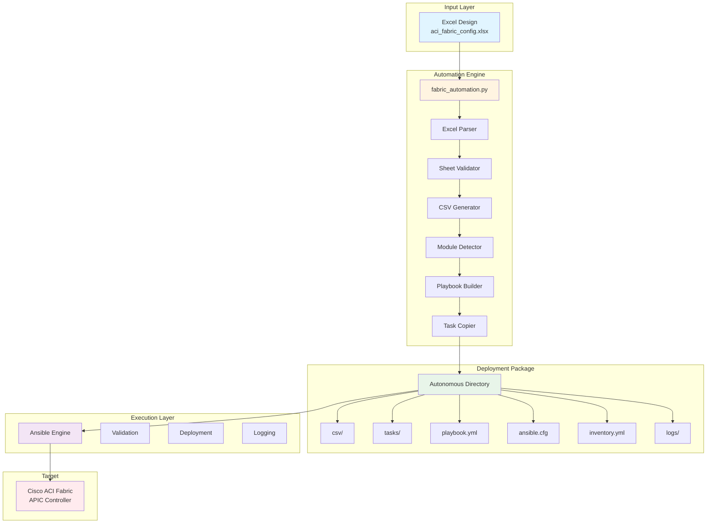
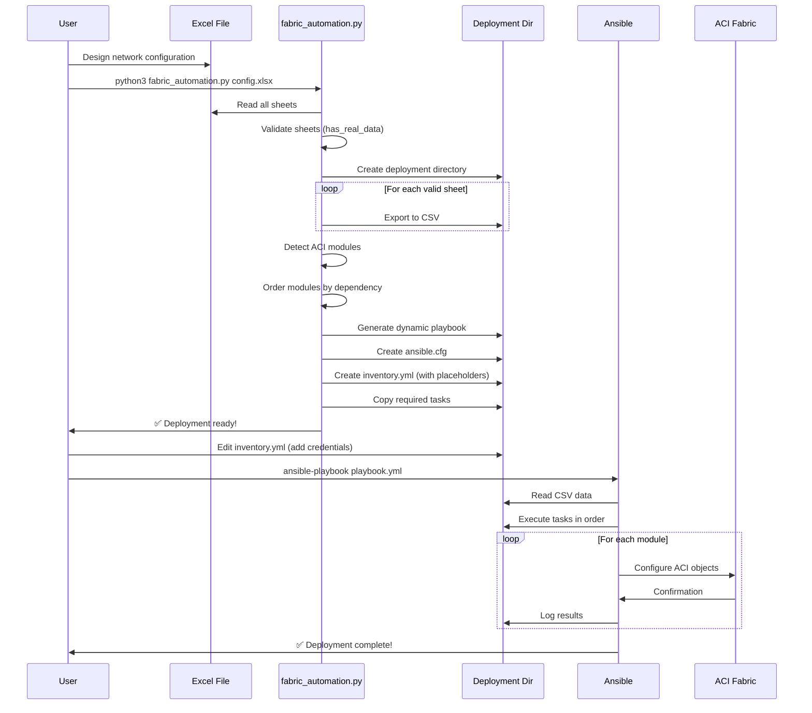

# 🚀 ACI Fabric Automation Engine

[](https://opensource.org/licenses/MIT)
[](https://www.python.org/downloads/)
[](https://docs.ansible.com/)
[](https://www.cisco.com/c/en/us/solutions/data-center-virtualization/application-centric-infrastructure/index.html)

> **Enterprise-grade automation solution for Cisco ACI fabric deployment using Excel-driven configuration management.**

## 📋 Table of Contents

- [Overview](#overview)
- [Features](#features)
- [Architecture](#architecture)
- [How It Works](#how-it-works)
- [Quick Start](#quick-start)
- [Installation](#installation)
- [Usage](#usage)
- [Excel Template Structure](#excel-template-structure)
- [Supported ACI Objects](#supported-aci-objects)
- [Examples](#examples)
- [Troubleshooting](#troubleshooting)
- [Contributing](#contributing)
- [License](#license)

## 🎯 Overview

The **ACI Fabric Automation Engine** (`fabric_automation.py`) is a production-ready solution that transforms Excel-based network designs into fully deployed Cisco ACI fabrics. By leveraging intelligent Excel parsing and dynamic Ansible playbook generation, it eliminates manual configuration errors and accelerates fabric deployment from days to minutes.

### Key Benefits

- **🎨 Design-First Approach**: Network engineers work in familiar Excel environment
- **⚡ Rapid Deployment**: Complete fabric deployment in under 30 minutes
- **🛡️ Error Prevention**: Automated validation and dependency management
- **🔄 Full Lifecycle**: Support for creation, modification, and deletion
- **📦 Autonomous Deployments**: Self-contained deployment directories with all dependencies
- **📊 Production Ready**: Enterprise-grade logging, validation, and rollback capabilities

## ✨ Features

### Core Capabilities

- **Smart Excel Parsing**: Automatic detection of valid configuration sheets
- **Dynamic Playbook Generation**: Creates optimized Ansible playbooks based on your data
- **Autonomous Deployments**: Copies only required tasks for self-contained deployment packages
- **Dependency Management**: Ensures correct deployment order for ACI objects (83 modules ordered)
- **State Management**: Support for create (`present`) and delete (`absent`) operations
- **Multi-Site Support**: Single codebase, multiple independent deployments
- **Dry-Run Mode**: Test configurations without making changes
- **Comprehensive Logging**: Full audit trail of all operations

### Supported Environments

- **Cisco ACI**: All modern APIC versions (4.x, 5.x, 6.x)
- **Python**: 3.8+ with pandas and openpyxl
- **Ansible**: Core 2.12+ with cisco.aci collection
- **Excel**: .xlsx files with structured data sheets

## 🏗️ Architecture

### System Overview



### Component Details

| Component | Purpose | Technology | Key Features |
|-----------|---------|------------|--------------|
| **Excel Parser** | Sheet detection and validation | Python + Pandas | Ignores system sheets, validates data presence |
| **CSV Generator** | Data transformation | Python | Cleans and exports to CSV format |
| **Module Detector** | ACI object discovery | Python | Identifies modules from CSV files |
| **Playbook Builder** | Dynamic Ansible generation | Python + YAML | Orders modules by dependency (83 module sequence) |
| **Task Copier** | Autonomous packaging | Python + shutil | Copies only required tasks for deployment |
| **Ansible Engine** | Orchestration | Ansible + cisco.aci | Executes deployment with full logging |

## 🔄 How It Works

### Workflow Diagram



### Detailed Process Flow

#### 1. **Excel Parsing Phase**
```python
# fabric_automation.py reads Excel file
- Ignore system sheets: Navigation, Sheet1-3, Template, Example, README
- For each sheet:
  - Check if first column has real data (has_real_data method)
  - Skip empty or invalid sheets
  - Export valid sheets to CSV
```

**Example:**
```
Excel: aci_fabric_config.xlsx (55 sheets total)
  ✅ tenant (3 rows) → tenant.csv
  ✅ vrf (5 rows) → vrf.csv
  ⏭️ Navigation → IGNORED (system sheet)
  ⏭️ Sheet1 → IGNORED (no data)
  ✅ epg (12 rows) → epg.csv
Result: 47 CSV files generated
```

#### 2. **Module Detection Phase**
```python
# Scan CSV directory
for csv_file in csv_dir/*.csv:
    module_name = "aci_" + csv_file.stem
    detected_modules.append(module_name)

# Creates: detected_modules_csv.yml
detected_modules:
  - aci_tenant
  - aci_vrf
  - aci_epg
  ...
```

#### 3. **Playbook Generation Phase**
```python
# Order modules by dependency (83 modules defined)
module_order = [
    'aci_vlan_pool',                    # 1. Infrastructure first
    'aci_domain',
    'aci_aep',
    'aci_tenant',                       # 2. Tenant objects
    'aci_vrf',
    'aci_bd',
    'aci_epg',
    'aci_contract',                     # 3. Security
    'aci_l3out',                        # 4. L3 connectivity
    ...
]

# Generate playbook with tasks in correct order
- name: "Deploy ACI from config.xlsx"
  tasks:
    - include_tasks: tasks/vlan_pool.yml
    - include_tasks: tasks/domain.yml
    ...
```

#### 4. **Autonomous Packaging Phase**
```python
# Copy only required tasks (copy_needed_tasks method)
for module in detected_modules:
    task_name = module.replace('aci_', '') + '.yml'
    copy(source_tasks/task_name → deployment/tasks/task_name)

Result: Self-contained deployment directory
```

#### 5. **Configuration Generation Phase**
```yaml
# Creates ansible.cfg
[defaults]
inventory = inventory.yml
host_key_checking = False
stdout_callback = yaml

# Creates inventory.yml with placeholders
aci_hostname: "YOUR_APIC_IP_HERE"
aci_username: "YOUR_USERNAME_HERE"
aci_password: "YOUR_PASSWORD_HERE"
```

#### 6. **Deployment Execution Phase**
```bash
# User fills credentials and runs
cd config/
ansible-playbook config.yml -i inventory.yml

# Ansible processes in order:
1. Read CSV files
2. Execute tasks (vlan_pool → domain → ... → epg)
3. Apply to APIC
4. Log results
```

### Key Algorithms

#### Smart Sheet Detection (`has_real_data`)
```python
def has_real_data(self, sheet_name):
    """Intelligent detection of sheets with actual data"""

    # Read sheet
    df = pd.read_excel(excel_file, sheet_name=sheet_name)

    # Empty check
    if df.empty:
        return False

    # Get first column
    first_col = df.iloc[:, 0]

    # Special case: Single row (header only)
    if len(first_col) == 1:
        value = first_col.iloc[0]
        return pd.notna(value) and str(value).strip()

    # Normal case: Check for data after header (row 0)
    for i in range(1, len(first_col)):
        value = first_col.iloc[i]
        if pd.notna(value) and str(value).strip():
            return True  # Found data!

    return False  # No data found
```

#### Dependency Ordering
The engine maintains a strict order of 83 modules across 7 phases:

1. **Infrastructure** (7 modules): VLAN Pools, Domains, AEP, VPC
2. **Interface Policies** (8 modules): CDP, LLDP, Link Level, Port Channel
3. **Switch/Interface Profiles** (5 modules): Leaf Profiles, Selectors
4. **Tenant Configuration** (9 modules): Tenants, VRFs, BDs, EPGs
5. **BGP Policies** (3 modules): Timers, Best Path, Address Family
6. **Security** (5 modules): Filters, Contracts, Bindings
7. **L3Out & Route Control** (20 modules): L3Out, BGP, External EPGs, Route Control

## 🚀 Quick Start

### Prerequisites
```bash
# Install Python dependencies
pip install pandas openpyxl

# Install Ansible and ACI collection
pip install ansible
ansible-galaxy collection install cisco.aci
```

### 30-Second Demo
```bash
# 1. Prepare your Excel configuration
# Use aci_fabric_config.xlsx as template

# 2. Generate deployment package
python3 fabric_automation.py aci_fabric_config.xlsx

# 3. Configure credentials
cd aci_fabric_config/
vim inventory.yml  # Fill in APIC IP, username, password

# 4. Validate (dry-run)
ansible-playbook aci_fabric_config.yml -i inventory.yml --check

# 5. Deploy
ansible-playbook aci_fabric_config.yml -i inventory.yml

# ✅ Done! Your ACI fabric is configured
```

### Generated Directory Structure
```
aci_fabric_config/
├── csv/                              # Configuration data
│   ├── tenant.csv                    # 47 CSV files
│   ├── vrf.csv
│   ├── bd.csv
│   └── ...
├── tasks/                            # Ansible tasks
│   ├── tenant.yml                    # Only required tasks copied
│   ├── vrf.yml
│   └── ...
├── aci_fabric_config.yml             # Main playbook (auto-generated)
├── detected_modules_csv.yml          # Detected modules list
├── ansible.cfg                       # Ansible configuration
├── inventory.yml                     # APIC credentials
└── logs/                             # Execution logs
```

## 📦 Installation

See [INSTALLATION.md](INSTALLATION.md) for detailed installation instructions including:
- Prerequisites and dependencies
- Python environment setup
- Ansible installation and configuration
- ACI collection installation
- Excel template setup
- Troubleshooting common installation issues

## 📖 Usage

### Basic Usage

```bash
# Generate deployment from Excel
python3 fabric_automation.py <excel_file.xlsx>
```

**Arguments:**
- `<excel_file.xlsx>`: **Required** - Path to your Excel configuration file

**Example:**
```bash
python3 fabric_automation.py aci_fabric_config.xlsx
```

**Output:**
```
🎯 Excel ACI → CSV Simple Export
📦 Nouvelle Architecture: Répertoire de déploiement par Excel
============================================================
📁 Fichier Excel spécifié: aci_fabric_config.xlsx
✅ Fichier Excel trouvé: aci_fabric_config.xlsx

📂 CRÉATION DU RÉPERTOIRE DE DÉPLOIEMENT
============================================================
📁 Répertoire de déploiement: aci_fabric_config/
✅ Répertoire créé: aci_fabric_config/

🚀 EXCEL → CSV : Export Simple
================================================================================
🧹 Nettoyage du répertoire aci_fabric_config/csv...
✅ Répertoire CSV créé/nettoyé: aci_fabric_config/csv

📋 55 onglets trouvés dans Excel

🔍 Analyse et export des onglets avec données...
--------------------------------------------------------------------------------
⏭️  Navigation                          → IGNORÉ (onglet système)
✅ tenant                               → tenant.csv (3x2) → aci_tenant
✅ vrf                                  → vrf.csv (5x3) → aci_vrf
✅ bd                                   → bd.csv (8x5) → aci_bd
⏭️  Sheet1                              → IGNORÉ (pas de données)
...

================================================================================
📊 RÉSUMÉ DE L'EXPORT
================================================================================
✅ Onglets exportés: 47
⏭️ Onglets ignorés: 8
📁 Fichiers CSV créés dans: aci_fabric_config/csv/
📋 Total onglets traités: 55

✅ Liste des modules créée: aci_fabric_config/detected_modules_csv.yml

🎯 GÉNÉRATION PLAYBOOK DYNAMIQUE
📋 Excel source: aci_fabric_config.xlsx
📝 Playbook cible: aci_fabric_config/aci_fabric_config.yml
🔧 Modules à inclure: 47

✅ Playbook dynamique créé: aci_fabric_config/aci_fabric_config.yml

📋 GÉNÉRATION DES FICHIERS DE CONFIGURATION
============================================================
✅ ansible.cfg → aci_fabric_config/ansible.cfg
✅ inventory.yml → aci_fabric_config/inventory.yml
⚠️  N'oubliez pas de remplir vos credentials dans inventory.yml!
✅ Répertoire logs créé: aci_fabric_config/logs/

📁 COPIE DES TASKS NÉCESSAIRES
============================================================
✅ tenant.yml
✅ vrf.yml
✅ bd.yml
...
✅ 47 fichiers tasks copiés vers aci_fabric_config/tasks/

============================================================
🎯 DÉPLOIEMENT PRÊT!
============================================================
📁 Répertoire: aci_fabric_config/
📂 Structure:
   ├── csv/                    (47 fichiers CSV)
   ├── aci_fabric_config.yml   (Playbook Ansible)
   ├── ansible.cfg             (Configuration Ansible)
   ├── inventory.yml           (Inventaire)
   ├── tasks/                  (Tâches Ansible)
   └── detected_modules_csv.yml

🚀 Pour déployer:
   cd aci_fabric_config/
   ansible-playbook aci_fabric_config.yml -i inventory.yml

💡 Répertoire AUTONOME avec tasks incluses
```

### Configure Credentials

Edit the generated `inventory.yml`:

```yaml
---
all:
  hosts:
    localhost:
      ansible_connection: local
      ansible_python_interpreter: "{{ ansible_playbook_python }}"

      # APIC Connection Settings
      aci_hostname: "192.168.1.100"        # Your APIC IP
      aci_username: "admin"                 # Your username
      aci_password: "YourSecurePassword"    # Your password
      aci_validate_certs: false
```

### Deploy to ACI

```bash
# Navigate to deployment directory
cd aci_fabric_config/

# Option 1: Dry-run (validation only)
ansible-playbook aci_fabric_config.yml -i inventory.yml --check

# Option 2: Deploy specific modules
ansible-playbook aci_fabric_config.yml -i inventory.yml --tags "tenant,vrf"

# Option 3: Full deployment
ansible-playbook aci_fabric_config.yml -i inventory.yml

# Option 4: Deploy with verbose logging
ansible-playbook aci_fabric_config.yml -i inventory.yml -vvv
```

### Advanced Operations

#### Delete Configuration (Rollback)
```bash
# Set global_state to absent
ansible-playbook aci_fabric_config.yml -i inventory.yml -e "deployment_state=absent"
```

#### Deploy Specific Objects
```bash
# Deploy only tenants and VRFs
ansible-playbook aci_fabric_config.yml -i inventory.yml --tags "tenant,vrf"

# Skip L3Out deployment
ansible-playbook aci_fabric_config.yml -i inventory.yml --skip-tags "l3out"
```

#### Multi-Site Deployments
```bash
# Generate deployment for production site
python3 fabric_automation.py production_aci.xlsx

# Generate deployment for dev site
python3 fabric_automation.py dev_aci.xlsx

# Deploy to production
cd production_aci/
ansible-playbook production_aci.yml -i inventory.yml

# Deploy to dev
cd ../dev_aci/
ansible-playbook dev_aci.yml -i inventory.yml
```

## 📊 Excel Template Structure

### Sheet Organization

Each Excel sheet represents one ACI object type. Sheet names must match ACI module names (without `aci_` prefix).

**Valid sheet names:**
```
tenant, vrf, bd, bd_subnet, ap, epg
vlan_pool, vlan_pool_encap_block
domain, domain_to_vlan_pool
aep, aep_to_domain, aep_to_epg
contract, filter, contract_subject
l3out, l3out_logical_node, l3out_interface
...
```

**System sheets (ignored):**
```
Navigation, Sheet1, Sheet2, Sheet3, Template, Example, README
```

### Data Requirements

1. **First row**: Column headers (must match ACI parameters)
2. **Subsequent rows**: Configuration data
3. **First column**: Must contain data for sheet to be processed

**Example - tenant sheet:**

| tenant | description |
|--------|-------------|
| Production | Production tenant |
| Development | Development tenant |
| DMZ | Demilitarized zone |

**Example - epg sheet:**

| epg | tenant | ap | bd | description |
|-----|--------|----|----|-------------|
| Web_EPG | Production | WebApp_AP | Web_BD | Web servers |
| App_EPG | Production | WebApp_AP | App_BD | Application servers |
| DB_EPG | Production | Database_AP | DB_BD | Database servers |

See [EXCEL_TEMPLATE.md](EXCEL_TEMPLATE.md) for complete template documentation.

## 🔧 Supported ACI Objects

### Infrastructure (14 objects)
- VLAN Pools (`vlan_pool`)
- VLAN Encapsulation Blocks (`vlan_pool_encap_block`)
- Physical/VMM Domains (`domain`)
- Domain-VLAN Pool Associations (`domain_to_vlan_pool`)
- Attachable Entity Profiles (`aep`)
- AEP-Domain Associations (`aep_to_domain`)
- VPC Protection Groups (`switch_policy_vpc_protection_gr`)
- Switch/Interface Profiles and Selectors
- Access Port Configurations

### Interface Policies (7 objects)
- CDP, LLDP, Link Level, MCP
- Port Channel, Spanning Tree
- Interface Configurations

### Tenant & Networking (9 objects)
- Tenants (`tenant`)
- VRF Contexts (`vrf`)
- Bridge Domains (`bd`)
- BD Subnets (`bd_subnet`)
- Application Profiles (`ap`)
- Endpoint Groups (`epg`)
- EPG-Domain Associations

### Security (5 objects)
- Filters (`filter`)
- Contracts (`contract`)
- Contract Subjects (`contract_subject`)
- EPG-Contract Bindings

### L3Out Configuration (16 objects)
- L3Out (`l3out`)
- Logical Node/Interface Profiles
- BGP Protocol Profiles and Peers
- Floating SVI (with secondary IPs)
- External EPGs and Subnets
- VPC Member configurations

### Route Control (4 objects)
- Match Rules (`match_rule`)
- Match Route Destinations (`match_route_destination`)
- Route Control Profiles (`route_control_profile`)
- Route Control Contexts (`route_control_context`)

**Total: 55+ ACI object types supported**

## 📚 Examples

### Example 1: Simple Tenant Deployment

**Excel (tenant sheet):**
| tenant | description |
|--------|-------------|
| MyTenant | My first tenant |

**Generated deployment:**
```bash
python3 fabric_automation.py simple.xlsx
cd simple/
ansible-playbook simple.yml -i inventory.yml
```

**Result:** Creates tenant "MyTenant" in ACI

### Example 2: Full Network Deployment

**Excel sheets:**
- `tenant`: MyTenant
- `vrf`: MyVRF
- `bd`: MyBD
- `ap`: MyApp
- `epg`: Web_EPG, App_EPG

**Deployment:**
```bash
python3 fabric_automation.py full_network.xlsx
cd full_network/
ansible-playbook full_network.yml -i inventory.yml
```

**Result:** Complete tenant with VRF, BD, AP, and EPGs

### Example 3: Infrastructure Setup

**Excel sheets:**
- `vlan_pool`: Prod_Pool (1000-1099)
- `domain`: Prod_Domain
- `aep`: Prod_AEP
- `switch_policy_vpc_protection_gr`: VPC_Group1

**Deployment:**
```bash
python3 fabric_automation.py infrastructure.xlsx
cd infrastructure/
ansible-playbook infrastructure.yml -i inventory.yml
```

**Result:** Complete infrastructure foundation

## 🐛 Troubleshooting

### Common Issues

#### Issue: "File Excel non trouvé"
```
❌ Fichier Excel non trouvé: config.xlsx
```
**Solution:** Ensure Excel file exists in current directory
```bash
ls -la *.xlsx
python3 fabric_automation.py existing_file.xlsx
```

#### Issue: "No modules detected"
```
⏭️ All sheets ignored (no data)
```
**Solution:** Ensure sheets have data in first column (row 2+)

#### Issue: "APIC connection failed"
```
failed: [localhost] => {"msg": "Connection to APIC failed"}
```
**Solution:** Check inventory.yml credentials
```yaml
aci_hostname: "192.168.1.100"  # Correct APIC IP
aci_username: "admin"           # Valid username
aci_password: "correct_password"
```

#### Issue: "Task file not found"
```
⚠️  tenant.yml (fichier non trouvé)
```
**Solution:** Ensure tasks/ directory exists in production_ready
```bash
ls -la production_ready/tasks/
```

#### Issue: "Dependencies not satisfied"
```
ERROR: Module cisco.aci not found
```
**Solution:** Install Ansible collection
```bash
ansible-galaxy collection install cisco.aci
```

### Debug Mode

Enable verbose logging:
```bash
# Level 1: Basic info
ansible-playbook config.yml -i inventory.yml -v

# Level 2: Detailed info
ansible-playbook config.yml -i inventory.yml -vv

# Level 3: Debug mode
ansible-playbook config.yml -i inventory.yml -vvv

# Level 4: Full debug
ansible-playbook config.yml -i inventory.yml -vvvv
```

Check logs:
```bash
# View last deployment
cat logs/ansible.log

# Monitor live deployment
tail -f logs/ansible.log
```

## 🤝 Contributing

We welcome contributions! See [CONTRIBUTING.md](CONTRIBUTING.md) for guidelines.

### Quick Contribution Guide

1. Fork the repository
2. Create a feature branch (`git checkout -b feature/NewModule`)
3. Make your changes
4. Test thoroughly
5. Commit with descriptive messages
6. Push and create a Pull Request

## 📄 License

This project is licensed under the MIT License - see the [LICENSE](LICENSE) file for details.

## 🆘 Support

- **Documentation**: See docs/ directory
- **Issues**: GitHub Issues
- **Architecture**: See [ARCHITECTURE.md](ARCHITECTURE.md)
- **Installation**: See [INSTALLATION.md](INSTALLATION.md)

---

**Made with ❤️ for Network Automation**
