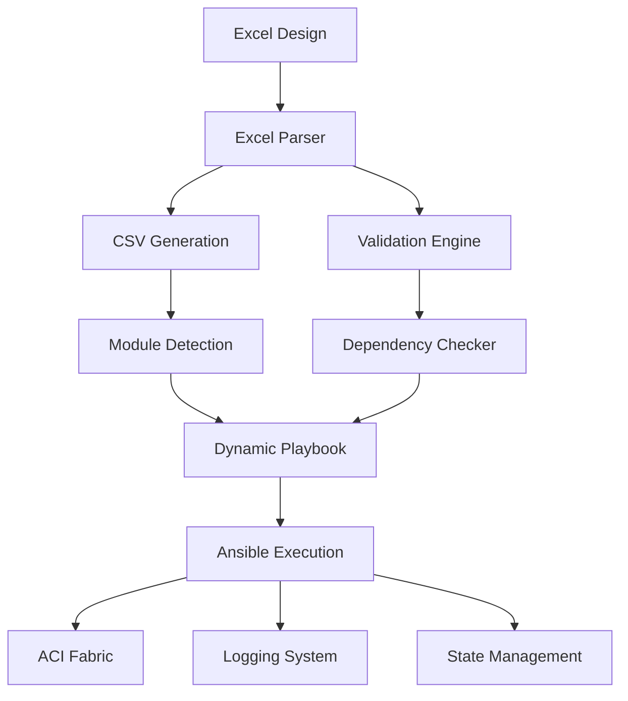

# 🚀 ACI Fabric Automation Engine

[](https://opensource.org/licenses/MIT)
[](https://www.python.org/downloads/)
[](https://docs.ansible.com/)
[](https://www.cisco.com/c/en/us/solutions/data-center-virtualization/application-centric-infrastructure/index.html)

> **Enterprise-grade automation solution for Cisco ACI fabric deployment using Excel-driven configuration management.**

## 📋 Table of Contents

- [Overview](#overview)
- [Features](#features)
- [Architecture](#architecture)
- [Quick Start](#quick-start)
- [Installation](#installation)
- [Usage](#usage)
- [Excel Template Structure](#excel-template-structure)
- [Supported ACI Objects](#supported-aci-objects)
- [Configuration](#configuration)
- [Examples](#examples)
- [Troubleshooting](#troubleshooting)
- [Contributing](#contributing)
- [License](#license)

## 🎯 Overview

The **ACI Fabric Automation Engine** is a production-ready solution that transforms Excel-based network designs into fully deployed Cisco ACI fabrics. By leveraging intelligent Excel parsing and dynamic Ansible playbook generation, it eliminates manual configuration errors and accelerates fabric deployment from days to minutes.

### Key Benefits

- **🎨 Design-First Approach**: Network engineers work in familiar Excel environment
- **⚡ Rapid Deployment**: Complete fabric deployment in under 30 minutes
- **🛡️ Error Prevention**: Automated validation and dependency management
- **🔄 Full Lifecycle**: Support for creation, modification, and deletion
- **📊 Production Ready**: Enterprise-grade logging, validation, and rollback capabilities

## ✨ Features

### Core Capabilities
- **Smart Excel Parsing**: Automatic detection of valid configuration sheets
- **Dynamic Playbook Generation**: Creates optimized Ansible playbooks based on your data
- **Dependency Management**: Ensures correct deployment order for ACI objects
- **State Management**: Support for create (`present`) and delete (`absent`) operations
- **Dry-Run Mode**: Test configurations without making changes
- **Comprehensive Logging**: Full audit trail of all operations

### Supported Environments
- **Cisco ACI**: All modern APIC versions (4.x, 5.x, 6.x)
- **Python**: 3.8+ with pandas support
- **Ansible**: Core 2.12+ with cisco.aci collection
- **Excel**: .xlsx files with structured data sheets

## 🏗️ Architecture



### Component Overview

| Component | Purpose | Technology |
|-----------|---------|------------|
| **Excel Parser** | Intelligent sheet detection and validation | Python + Pandas |
| **CSV Engine** | Data transformation and normalization | Python |
| **Module Detector** | Dynamic ACI object discovery | Python |
| **Playbook Generator** | Ansible automation creation | Python + Jinja2 |
| **Task Library** | 50+ ACI object handlers | Ansible + YAML |
| **Deployment Engine** | Orchestrated fabric deployment | Ansible + cisco.aci |

## 🚀 Quick Start

### Prerequisites
```bash
# Install Python dependencies
pip install pandas openpyxl

# Install Ansible and ACI collection
pip install ansible
ansible-galaxy collection install cisco.aci
```

### 30-Second Demo
```bash
# 1. Clone and setup
git clone https://github.com/your-org/aci-fabric-automation.git
cd aci-fabric-automation
cp .env.example .env

# 2. Configure your APIC credentials in .env
vim .env

# 3. Convert Excel to deployment-ready configuration
python3 excel_to_csv_simple.py aci_fabric_config.xlsx

# 4. Deploy to ACI fabric
ansible-playbook -i inventory.yml aci_fabric_config.yml
```

## 📦 Installation

### System Requirements
- **Operating System**: Linux, macOS, or Windows with WSL
- **Python**: 3.8 or higher
- **Memory**: 2GB+ recommended for large configurations
- **Network**: Connectivity to APIC management interface

### Detailed Setup

1. **Clone the repository**
   ```bash
   git clone https://github.com/your-org/aci-fabric-automation.git
   cd aci-fabric-automation
   ```

2. **Create Python virtual environment**
   ```bash
   python3 -m venv venv
   source venv/bin/activate  # On Windows: venv\Scripts\activate
   ```

3. **Install dependencies**
   ```bash
   pip install -r requirements.txt
   ansible-galaxy collection install cisco.aci
   ```

4. **Configure environment**
   ```bash
   cp .env.example .env
   # Edit .env with your APIC credentials
   ```

5. **Verify installation**
   ```bash
   python3 excel_to_csv_simple.py --help
   ansible --version
   ```

## 💼 Usage

### Basic Workflow

#### Step 1: Prepare Excel Configuration
Create or modify your Excel file following the [template structure](#excel-template-structure):

```excel
Sheet: vlan_pool
pool,description,pool_allocation_mode
Prod_VLAN_Pool,Production VLAN Pool,static
Dev_VLAN_Pool,Development VLAN Pool,dynamic

Sheet: tenant
tenant,description
Production,Production tenant
Development,Development tenant
```

#### Step 2: Generate Configuration
```bash
# Convert Excel to Ansible-ready format
python3 excel_to_csv_simple.py your_fabric_design.xlsx

# This creates:
# - csv/ directory with individual object files
# - detected_modules_csv.yml (discovered objects)
# - your_fabric_design.yml (deployment playbook)
```

#### Step 3: Validate Configuration
```bash
# Dry-run to validate without changes
ansible-playbook -i inventory.yml your_fabric_design.yml --check

# Syntax validation
ansible-playbook --syntax-check your_fabric_design.yml
```

#### Step 4: Deploy to ACI
```bash
# Full deployment
ansible-playbook -i inventory.yml your_fabric_design.yml

# Deploy specific components
ansible-playbook -i inventory.yml your_fabric_design.yml --tags "infrastructure"
ansible-playbook -i inventory.yml your_fabric_design.yml --tags "tenants"
```

### Advanced Operations

#### Selective Deployment
```bash
# Deploy only VLAN pools and domains
ansible-playbook -i inventory.yml config.yml --tags "vlan_pool,domain"

# Deploy everything except L3Out
ansible-playbook -i inventory.yml config.yml --skip-tags "l3out"
```

#### State Management
```bash
# Create all objects (default)
ansible-playbook -i inventory.yml config.yml

# Remove all objects (DESTRUCTIVE)
ansible-playbook -i inventory.yml config.yml -e "deployment_state=absent"

# Query existing configuration
ansible-playbook -i inventory.yml config.yml -e "deployment_state=query"
```

#### Incremental Updates
```bash
# Update specific tenant configuration
ansible-playbook -i inventory.yml config.yml --tags "tenant,vrf,bd,epg"

# Add new interface policies
ansible-playbook -i inventory.yml config.yml --tags "interface_policy"
```

## 📊 Excel Template Structure

### Sheet Naming Convention
Each Excel sheet must match the corresponding ACI object type. The automation engine uses exact sheet name matching:

| Sheet Name | ACI Object | Purpose |
|------------|------------|---------|
| `vlan_pool` | VLAN Pools | Static/Dynamic VLAN allocation |
| `domain` | Physical Domains | Infrastructure domain configuration |
| `aep` | Attachable Entity Profiles | Switch port grouping |
| `tenant` | Tenants | Logical network separation |
| `vrf` | VRF Contexts | Layer 3 routing contexts |
| `bd` | Bridge Domains | Layer 2 broadcast domains |
| `epg` | Endpoint Groups | Application endpoint grouping |
| `contract` | Security Contracts | Micro-segmentation policies |
| `l3out` | Layer 3 Outside | External connectivity |

> **⚠️ Important**: Sheet names are case-sensitive and must match exactly as shown above.

### Required Column Structure

#### Infrastructure Objects

**vlan_pool** sheet:
```excel
pool,description,pool_allocation_mode
Prod_Pool,Production VLAN Pool,static
Dev_Pool,Development VLAN Pool,dynamic
```

**domain** sheet:
```excel
domain,domain_type,description
Prod_Domain,phys,Production Physical Domain
Dev_Domain,phys,Development Physical Domain
```

**aep** sheet:
```excel
aep,description
Prod_AEP,Production Attachable Entity Profile
Dev_AEP,Development Attachable Entity Profile
```

#### Tenant Objects

**tenant** sheet:
```excel
tenant,description
Production,Production environment tenant
Development,Development environment tenant
```

**vrf** sheet:
```excel
tenant,vrf,description
Production,Prod_VRF,Production VRF context
Development,Dev_VRF,Development VRF context
```

**bd** sheet:
```excel
tenant,bd,vrf,description
Production,Web_BD,Prod_VRF,Web servers bridge domain
Production,App_BD,Prod_VRF,Application servers bridge domain
```

**epg** sheet:
```excel
epg,tenant,ap,bd,description
WebServers_EPG,Production,WebApp_AP,Web_BD,Web servers endpoint group
AppServers_EPG,Production,WebApp_AP,App_BD,Application servers endpoint group
```

### Data Validation Rules

- **Required Fields**: All columns marked in templates are mandatory
- **Naming Conventions**: Use alphanumeric characters and underscores only
- **Dependencies**: Ensure parent objects exist (e.g., VRF before BD)
- **Consistency**: Object names must be consistent across sheets

## 🎯 Supported ACI Objects

The automation engine supports 47 different ACI object types, organized by category:

### Infrastructure Layer (8 objects)
- VLAN Pools and Encapsulation Blocks
- Physical and VMM Domains
- Attachable Entity Profiles (AEP)
- Switch and Interface Profiles
- VPC Protection Groups

### Interface Policies (7 objects)
- CDP, LLDP, Link Level Policies
- Port Channel and Spanning Tree
- MCP and Interface Configurations
- Leaf Policy Groups

### Tenant Configuration (15 objects)
- Tenants and VRF Contexts
- Bridge Domains and Subnets
- Application Profiles and EPGs
- Endpoint Group Associations

### Security Policies (5 objects)
- Filters and Filter Entries
- Contracts and Contract Subjects
- EPG to Contract Bindings

### L3 Outside Connectivity (12 objects)
- L3Out Configuration
- Logical Node and Interface Profiles
- BGP Protocol Profiles and Peers
- External EPGs and Subnets
- Floating SVI Configuration

### Complete Object List
<details>
<summary>Click to expand full list of supported objects</summary>

```yaml
Infrastructure:
- aci_vlan_pool
- aci_vlan_pool_encap_block
- aci_domain
- aci_domain_to_vlan_pool
- aci_aep
- aci_aep_to_domain
- aci_switch_policy_vpc_protection_gr
- aci_interface_policy_leaf_profile

Interface Policies:
- aci_interface_policy_cdp
- aci_interface_policy_link_level
- aci_interface_policy_lldp
- aci_interface_policy_mcp
- aci_interface_policy_port_channel
- aci_interface_policy_spanning_tree
- aci_interface_policy_leaf_policy_gr

Tenant Configuration:
- aci_tenant
- aci_vrf
- aci_bd
- aci_bd_subnet
- aci_ap
- aci_epg
- aci_aep_to_epg
- aci_epg_to_domain
- aci_bd_to_l3out

Security:
- aci_filter
- aci_contract
- aci_contract_subject
- aci_contract_subject_to_filter
- aci_epg_to_contract

L3Out:
- aci_l3out
- aci_l3out_logical_node_profile
- aci_l3out_logical_node
- aci_l3out_logical_interface_profile
- aci_l3out_interface
- aci_l3out_bgp_protocol_profile
- aci_l3out_bgp_peer
- aci_l3out_extepg
- aci_l3out_extsubnet
- aci_l3out_floating_svi
- aci_l3out_floating_svi_path
- aci_l3out_bgp_peer_floating
```
</details>

## ⚙️ Configuration

### Environment Variables (.env)

```bash
# APIC Connection
ACI_HOSTNAME=your-apic.company.com
ACI_USERNAME=admin
ACI_PASSWORD=your_secure_password

# SSL Configuration
ACI_VALIDATE_CERTS=false  # Set to true for production

# Deployment Options
GLOBAL_STATE=present      # present, absent, or query
CSV_DIR=csv              # Directory for generated CSV files

# Performance Tuning
ANSIBLE_TIMEOUT=300      # Connection timeout in seconds
ANSIBLE_FORKS=5          # Parallel execution threads
ANSIBLE_GATHERING=explicit # Fact gathering mode
```

### Ansible Configuration (ansible.cfg)

```ini
[defaults]
inventory = inventory.yml
host_key_checking = False
timeout = 30
gathering = explicit
retry_files_enabled = False
stdout_callback = yaml
result_format = yaml
deprecation_warnings = False
interpreter_python = /usr/bin/python3
log_path = logs/ansible.log
verbosity = 2

[inventory]
enable_plugins = yaml, ini

[ssh_connection]
ssh_args = -o ControlMaster=auto -o ControlPersist=60s
```

### Inventory Configuration (inventory.yml)

```yaml
---
all:
  hosts:
    localhost:
      ansible_connection: local
  vars:
    # ACI Connection Parameters
    aci_hostname: "{{ lookup('env', 'ACI_HOSTNAME') }}"
    aci_username: "{{ lookup('env', 'ACI_USERNAME') }}"
    aci_password: "{{ lookup('env', 'ACI_PASSWORD') }}"
    aci_validate_certs: "{{ lookup('env', 'ACI_VALIDATE_CERTS') | default(false) | bool }}"

    # Deployment Configuration
    csv_dir: "{{ lookup('env', 'CSV_DIR') | default('csv') }}"
    global_state: "{{ lookup('env', 'GLOBAL_STATE') | default('present') }}"
```

## 📖 Examples

### Example 1: Basic Tenant Deployment

**Excel Configuration:**
```excel
Sheet: tenant
tenant,description
MyTenant,My application tenant

Sheet: vrf
tenant,vrf,description
MyTenant,MyVRF,Application VRF

Sheet: bd
tenant,bd,vrf,description
MyTenant,Web_BD,MyVRF,Web tier bridge domain
MyTenant,App_BD,MyVRF,App tier bridge domain

Sheet: epg
epg,tenant,ap,bd,description
Web_EPG,MyTenant,MyApp_AP,Web_BD,Web servers
App_EPG,MyTenant,MyApp_AP,App_BD,Application servers
```

**Deployment:**
```bash
python3 excel_to_csv_simple.py tenant_config.xlsx
ansible-playbook -i inventory.yml tenant_config.yml --tags "tenants"
```

### Example 2: Infrastructure Setup

**Excel Configuration:**
```excel
Sheet: vlan_pool
pool,description,pool_allocation_mode
Infrastructure_Pool,Infrastructure VLAN Pool,static

Sheet: domain
domain,domain_type,description
Infra_Domain,phys,Infrastructure Physical Domain

Sheet: aep
aep,description
Server_AEP,Server connectivity profile
```

**Deployment:**
```bash
python3 excel_to_csv_simple.py infra_config.xlsx
ansible-playbook -i inventory.yml infra_config.yml --tags "infrastructure"
```

### Example 3: Security Policies

**Excel Configuration:**
```excel
Sheet: filter
filter,tenant,entry,ethertype,ip_protocol,dst_port_start,dst_port_end
Web_Filter,MyTenant,HTTP,ip,tcp,80,80
Web_Filter,MyTenant,HTTPS,ip,tcp,443,443

Sheet: contract
contract,tenant,description
Web_Contract,MyTenant,Web server access contract

Sheet: epg_to_contract
epg,tenant,ap,contract,contract_type
Web_EPG,MyTenant,MyApp_AP,Web_Contract,provider
App_EPG,MyTenant,MyApp_AP,Web_Contract,consumer
```

**Deployment:**
```bash
python3 excel_to_csv_simple.py security_config.xlsx
ansible-playbook -i inventory.yml security_config.yml --tags "security"
```

## 🔧 Troubleshooting

### Common Issues and Solutions

#### Issue: "Sheet not found" Error
```bash
Error: Sheet 'vlan_pools' not found in Excel file
```
**Solution**: Ensure sheet names match exactly (case-sensitive):
- ✅ Correct: `vlan_pool`
- ❌ Incorrect: `vlan_pools`, `VLAN_Pool`, `Vlan_Pool`

#### Issue: Missing Dependencies
```bash
Error: VRF 'MyVRF' not found for Bridge Domain 'MyBD'
```
**Solution**: Ensure parent objects are defined before child objects:
1. Create Tenant first
2. Create VRF in that Tenant
3. Create Bridge Domain referencing the VRF

#### Issue: Connection Timeout
```bash
Error: Connection to APIC timed out
```
**Solutions**:
1. Verify APIC hostname/IP in `.env`
2. Check network connectivity: `ping your-apic-ip`
3. Verify credentials are correct
4. Increase timeout in `ansible.cfg`

#### Issue: SSL Certificate Error
```bash
Error: SSL certificate verification failed
```
**Solution**: Set `ACI_VALIDATE_CERTS=false` in `.env` for lab environments

### Debug Mode

Enable verbose logging for troubleshooting:

```bash
# Maximum verbosity
ansible-playbook -i inventory.yml config.yml -vvvv

# Check specific task execution
ansible-playbook -i inventory.yml config.yml --start-at-task="Create tenants"

# Validate without execution
ansible-playbook -i inventory.yml config.yml --check --diff
```

### Log Analysis

```bash
# View real-time logs
tail -f logs/ansible.log

# Search for errors
grep -i error logs/ansible.log

# View last deployment summary
grep -A 10 "PLAY RECAP" logs/ansible.log | tail -11
```

### Validation Commands

```bash
# Verify Excel file structure
python3 -c "import pandas as pd; print(pd.ExcelFile('config.xlsx').sheet_names)"

# Test APIC connectivity
ansible all -i inventory.yml -m ping

# Validate generated playbook syntax
ansible-playbook --syntax-check generated_playbook.yml
```

## 🤝 Contributing

We welcome contributions to improve the ACI Fabric Automation Engine!

### Development Setup

1. Fork the repository
2. Create a feature branch: `git checkout -b feature/amazing-feature`
3. Make your changes
4. Add tests for new functionality
5. Ensure all tests pass: `python -m pytest tests/`
6. Commit your changes: `git commit -m 'Add amazing feature'`
7. Push to the branch: `git push origin feature/amazing-feature`
8. Open a Pull Request

### Contribution Guidelines

- **Code Style**: Follow PEP 8 for Python code
- **Documentation**: Update README.md for new features
- **Testing**: Add unit tests for new functionality
- **Compatibility**: Ensure compatibility with Python 3.8+
- **Security**: Never commit credentials or sensitive data

### Adding New ACI Objects

To add support for a new ACI object type:

1. **Create Task File**: Add `tasks/new_object.yml`
2. **Update Parser**: Add object to `excel_to_csv_simple.py` module order
3. **Add Template**: Document Excel sheet structure in README
4. **Test**: Verify with sample data
5. **Document**: Update supported objects list

## 📄 License

This project is licensed under the MIT License - see the [LICENSE](LICENSE) file for details.

## 🙏 Acknowledgments

- **Cisco Systems** - For the ACI platform and cisco.aci Ansible collection
- **Ansible Community** - For the excellent automation framework
- **Python Community** - For pandas and data processing libraries

## 📞 Support

- **Issues**: [GitHub Issues](https://github.com/your-org/aci-fabric-automation/issues)
- **Discussions**: [GitHub Discussions](https://github.com/your-org/aci-fabric-automation/discussions)
- **Documentation**: [Wiki](https://github.com/your-org/aci-fabric-automation/wiki)

---

**⭐ If this project helps you automate your ACI deployments, please give it a star!**

Made with ❤️ for network automation